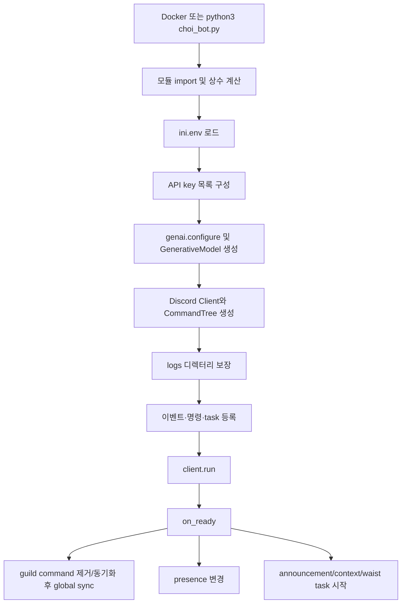
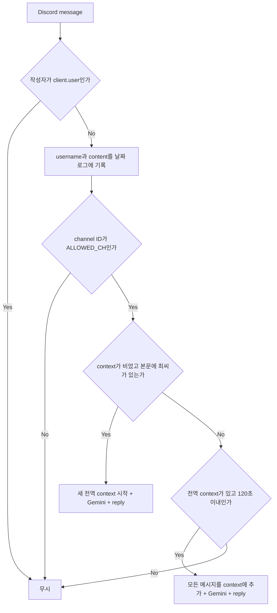
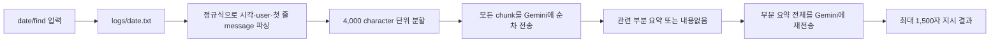

# Choi_bot 현재 아키텍처

이 문서는 2026-09-14의 로컬 작업본(`main`, 분석 시작 시 원격 커밋 `d69e8ef`)을 실행하지 않고 정적으로 분석한 결과다. 실제 Discord 및 Gemini API 호출은 수행하지 않았다. 분석 시작 당시 미커밋이던 `choi_bot.py`는 현재 개발 중인 유효한 구현으로 보고 포함했으며, 감사 도중 별도 로컬 커밋 `caec19b`로 보존됐다.

## 1. 프로젝트 파일 구조

| 경로 | 역할 | 현재 사용 여부 |
| --- | --- | --- |
| `choi_bot.py` | Discord client, 이벤트, 전역 상태, Gemini 호출, 로그, slash command 전체 | Docker의 실제 entrypoint |
| `Dockerfile` | Python 3.11 이미지 생성 및 `choi_bot.py` 실행 | 사용 |
| `requirements.txt` | Discord, dotenv, Google Generative AI 의존성 | Docker build에서 사용 |
| `run.sh` | 기존 이미지로 컨테이너 1회 실행 | 수동 실행용 |
| `restart.sh` | 기존 컨테이너 중지/삭제 후 이미지 재빌드, `--restart always`로 실행 | 수동 배포용 |
| `auto_restart.py` | 파일 변경을 polling하여 tmux 세션에 Ctrl-C와 재실행 명령 전달 | Docker 경로에서는 미사용; 별도 개발 도구 |
| `.gitignore` | `*.env`, `logs/`, `logs_bak/`, `auto_restart.py` 제외 | 사용. 단, 이미 추적 중인 `auto_restart.py`에는 효과 없음 |
| `README.md` | 한 줄 제목만 존재 | 실질 문서 역할 없음 |
| `ini.env` | Gemini API key 1~6과 Discord token | 런타임 사용, Git 비추적 |
| `logs/*.txt` | 날짜별 Discord 메시지 로그 | 런타임 생성, Git 비추적 |
| `logs_bak/` | 과거 로그 백업 | 애플리케이션에서는 미사용, Git 비추적 |

`.dockerignore`는 없다. 따라서 Git에서 제외된 `ini.env`, `logs/`, `logs_bak/`도 현재 `COPY . .`의 Docker build context 및 이미지 레이어에 포함된다.

## 2. 프로그램 시작 과정

`Dockerfile`은 `python:3.11-slim AS builder` 하나만 사용하는 단일 stage다. 의존성을 설치하고 저장소 전체를 복사한 다음 `python -u choi_bot.py`를 실행한다. `run.sh`는 이미지 빌드를 하지 않고 `--restart` 정책도 지정하지 않는다. `restart.sh`는 컨테이너를 중지·삭제하고 빌드한 뒤 `--restart always`로 실행한다. 두 스크립트 모두 호스트 `logs`를 `/app/logs`에 mount하고 `ini.env`를 `--env-file`로 전달한다.

명시적인 signal handler나 애플리케이션 수준 graceful shutdown은 없다. `discord.Client.run()`의 기본 lifecycle에 의존한다. 최상위 초기화나 `client.run()`에서 복구되지 않은 예외가 나면 프로세스가 끝나며, 재기동 여부는 컨테이너 실행 방식에 따라 다르다. `auto_restart.py`는 `watchdog`와 tmux에 의존하지만 `requirements.txt`에 `watchdog`가 없고 Docker에서는 실행되지 않는다.

중요한 초기화 순서 문제로, `API_KEYS`가 비어 있는지 검사하기 전에 `API_KEYS[0]`을 사용한다(`choi_bot.py:216-220`). 키가 없으면 의도한 `ValueError`가 아니라 `IndexError`가 먼저 발생한다.

## 3. Discord event flow

`discord.Intents.default()`에 messages, message content, members, presences, guilds를 명시적으로 활성화한다(`choi_bot.py:292-298`). Developer Portal의 privileged intent 설정과 봇 권한도 일치해야 한다.

`on_ready()`는 특정 guild의 command를 지우고 guild sync한 다음 global sync한다. 이어 presence를 바꾸고 세 background loop를 시작한다. reconnect로 `on_ready()`가 다시 호출되면 이미 실행 중인 task에 `start()`를 다시 호출할 위험이 있다.

자기 자신만 제외하므로 다른 Discord bot과 webhook 메시지도 로그 및 대화 처리 대상이 될 수 있다. mention, bot reply, 일반 reply, thread, guild, channel, user를 별도로 판별하지 않는다. slash command에는 `ALLOWED_CH` 검사가 공통 적용되지 않는다.

## 4. 일반 대화 flow

1. 모든 비-self 메시지를 허용 채널 검사 전에 `save__logs()`로 기록한다.
2. 허용 채널이면 `is_called()`를 평가한다. 구현상 `최씨` 포함 여부만 실질적인 시작 조건이며 `영원` 단독 호출은 인식하지 않는다.
3. context가 비어 있을 때 호출되면 username을 `USER_MAP`으로 치환하고 사용자 메시지를 추가한다.
4. `CHARACTER_PROMPT`, 새 대화 표지, 질문, 출력 규칙을 합쳐 Gemini에 보낸다.
5. context가 살아 있는 동안에는 호출 여부와 무관하게 허용 채널의 모든 메시지를 추가하고 전체 context를 다시 보낸다.
6. 응답에 `00100`이 없으면 채널에 출력한다. 있으면 사용자에게 보내지 않지만 로그/context에는 남긴다.
7. 응답에 `마이크 끄는 소리`가 있으면 출력한 뒤 전역 context를 지우고 공지 채널에 reset 메시지를 보낸다.

## 5. context lifecycle

| 상태 | 범위/형태 | 변경 시점 |
| --- | --- | --- |
| `conversation_context` | 프로세스 전체 단일 `deque(maxlen=20)` | 일반 메시지와 봇 응답마다 append |
| `active_users` | 프로세스 전체 단일 username/매핑명 set | context 메시지마다 add, reset 때 clear |
| `last_conversation_time` | 프로세스 전체 Unix time | `update_context()`마다 갱신 |
| `reset_flag` | 0/1 전역 flag | 새/연속 대화에서 0, reset에서 1 |
| `last_reset_time` | 마지막 자동 reset 시간 | `check_context()`에서 갱신 |

범위는 guild별, channel별, thread별, user별이 아닌 완전한 global이다. A가 한 허용 채널에서 대화를 시작하면 120초 동안 다른 허용 채널의 B/C 대화도 같은 context에 들어갈 수 있다. 동시 handler가 같은 deque, set, timestamp, flag를 lock 없이 수정하고 같은 전역 LLM model/key 상태를 사용한다. 상태는 메모리에만 있어 재시작하면 소실된다.

`check_context()`는 30초마다 `is_alive()`를 검사한다. timeout 후 `clear_context()`가 공지 채널에 reset 알림을 보낸다. `/stop`도 동일한 전역 context를 누구나 초기화할 수 있다. `clear_context()`는 `last_conversation_time`을 초기화하지 않는다.

## 6. LLM request flow

모든 현재 호출은 `generate_content_timeout()`을 경유한다. 동기식 `model.generate_content()`는 executor thread에서 수행하고 각 attempt에 20초 `asyncio.wait_for()`를 적용한다. 따라서 Discord event loop 자체는 직접 block하지 않지만, timeout은 executor의 실제 요청을 취소하지 못한다.

| 호출 위치 | 용도 | prompt 구성 | history/persona | 호출 수 |
| --- | --- | --- | --- | --- |
| `on_message()` 새 대화 | 캐릭터 응답 | persona + 사용자 메시지 + 출력 규칙 | persona Yes, history No | 1 |
| `on_message()` 연속 대화 | 캐릭터 응답 | persona + global context + 최신 질문 | persona/history Yes | 메시지마다 1 |
| `summary()` flag 0 | 일별 요약 | 각 4,000자 chunk + 요약 지시, 이후 부분 요약 통합 | persona No | chunk 수 + 1, 재시도 제외 |
| `summary()` flag 1 | `/찾기` | 검색어 + 모든 chunk + 검색 요약, 이후 통합 | persona No | chunk 수 + 1, 재시도 제외 |
| `/질문` | 짧은 정보 답변 | persona + 사용자 prompt | persona Yes, 대화 history No | 1 |
| `/알려줘` | 2줄 정보 답변 | persona + 사용자 prompt | persona Yes, 대화 history No | 1 |
| `/자세히` | 상세 정보 답변 | 별도 style 지시 + 사용자 prompt | persona/history No | 1 |
| 점·저메추 | 메뉴 후보 생성 후 5개 선택 | 요청사항을 두 prompt에 삽입 | persona/history No | 2 |
| 번역 UI | 선택 언어 + 원문 + 형식 규칙 | persona/history No | 1 |

wrapper는 timeout 및 quota/429로 판정된 예외에 대해 최대 API key 개수만큼 key를 바꿔 재시도한다. 비-quota 5xx, 401, 403 등은 즉시 다시 던진다. exponential backoff나 jitter는 없고 key 교체 사이 0.5초만 기다린다. 요약은 wrapper 바깥에서도 key 수만큼 재시도하므로 최악에는 한 chunk당 key 수의 제곱에 가까운 호출이 가능하다.

## 7. API key rotation

`ini.env`에서 `GOOGLE_API_KEY1`~`6`을 읽고 빈 값을 제거한다. `current_api_index=0`, `call_count=0`으로 시작한다. `conf_next()`는 count가 3 이상일 때 다음 key로 회전하므로, 이 함수가 매 호출 전에 빠짐없이 실행된다는 전제에서는 네 번째 진입 직전에 회전한다. 그러나 `/질문`, `/알려줘`, `/자세히`는 현재 `conf_next()`를 호출하지 않고, 대화·요약·번역·메뉴 경로의 호출 방식도 일관되지 않아 실제 요청 수 기준 rotation이 아니다.

timeout 또는 quota 판정 시에도 다음 key로 회전한다. 전역 `model`, index, count에는 lock이 없어 동시 요청이 서로의 key/model을 변경한다. key 값 자체는 현재 출력하지 않고 index만 출력한다. 단, 공급자 예외 전문은 console과 Discord에 노출될 수 있다.

## 8. logging

`save__logs(user, msg)`는 서버 local time 기준 `logs/YYYY-MM-DD.txt`에 `[YYYY-MM-DD HH:MM:SS] user: msg`를 UTF-8 append한다. Discord `message.author.name`을 사용하며 immutable user ID, guild/channel/thread/message ID는 저장하지 않는다. 봇의 응답과 slash command prompt 일부도 별도 문자열 user(`USER`, `최씨 봇`)로 저장된다.

허용 채널 검사 전에 기록하므로 봇이 접근 가능한 모든 채널의 비-self 메시지가 저장된다. 다른 bot도 제외하지 않는다. newline escaping, file lock, rotation, retention, deletion, consent enforcement가 없다. 여러 줄 메시지는 summary parser가 첫 줄만 읽고 나머지는 버린다. 로그 파일은 Git에서는 제외되지만 Docker image에는 현재 포함된다.

## 9. Slash command 전체 목록

공통 `send()`는 initial response 전에는 `interaction.response.send_message()`를 쓰고, 이미 응답했으면 `interaction.channel.send()`를 쓴다. 후자의 경우 ephemeral 보장이 사라지고 interaction followup token도 사용하지 않는다.

| 명령 | 입력 | 실행 흐름 / 상태·파일 | LLM | 권한 및 오류/잠재 문제 |
| --- | --- | --- | --- | --- |
| `/test` | 없음 | `Test Message` 전송 | No | 제한/별도 오류 처리 없음 |
| `/로그` | `n` 1~100 | 최신 날짜명 로그의 끝 n줄을 1,700자 chunk로 출력 | No | 제한 없음; 모든 대화 공개 가능, code fence escaping 없음 |
| `/config` | `command`, `value?`, `args?` | `stopflag`, 메모리 `USER_MAP` 조회·수정 | No | administrator 검사 있음; 재시작 시 변경 소실 |
| `/요약` | `date` | 해당 `.txt` 파싱 → chunk 요약 → 최종 요약 | Yes | 제한 없음; 입력 검증 없음; 오류 전문 표시 가능 |
| `/찾기` | `date`, `find` | `/요약`과 동일하되 검색 지시 사용 | Yes | 제한 없음; 모든 chunk 외부 전송 및 결과 환각 가능 |
| `/정보` | 없음 | 시작 때 고정된 `INFORMATION` 전송 | No | 함수 내 갱신한 `now`가 반영되지 않아 시작 시각만 표시 |
| `/후앰아이` | 없음 | 고정 persona 정보 전송 | No | 제한 없음; 개인정보성 관계 정보 노출 가능 |
| `/stop` | 없음 | global context clear, 공지 채널과 호출 채널에 알림 | No | 제한 없음; 다른 사용자의 세션도 종료 |
| `/질문` | `prompt` | prompt 로그 → 단일 정보 질의 → 응답 로그 | Yes | defer하지 않아 3초 initial response 만료 위험; 길이 분할 없음 |
| `/알려줘` | `prompt` | defer → 상태 메시지 → 질의 → 결과/시간 표시 | Yes | 결과는 일반 channel send; 길이 분할 없음 |
| `/자세히` | `prompt` | defer → 상태 메시지 → 상세 질의 | Yes | 2,000자 지시만 믿음; 실제 제한 검사 없음 |
| `/패치노트` | 없음 | 고정 `PATCHNOTE` 전송 | No | 제한 없음 |
| `/언제와` | 없음 | 두 기준일로부터 local elapsed time 계산 | No | 미래/시간대 변화 시 음수/부정확 가능 |
| `/유저` | `option?`, `user_name?` | `USER_MAP` 전체 출력 | No | 제한 없음; `user_name` 미사용, help 문자열도 실제 전송 안 함 |
| `/점메추` | `message?` | 15개 후보 생성 → 다시 5개 선택 | Yes (2) | help여도 return하지 않아 LLM 호출 지속; 길이/권한 제한 없음 |
| `/저메추` | `message?` | 점메추와 동일, 저녁 label | Yes (2) | 동일 |
| `/번역` | UI modal/select | View별 원문·언어 메모리 저장 → 번역 | Yes | component를 누른 사용자가 원 요청자인지 검사 없음; 결과가 공유됨 |
| `/알림` | `role` | guild role ID를 파싱해 호출자에게 부여 | No | autocomplete만 whitelist; 직접 ID 입력으로 우회 가능 |
| `/해제` | `role` | guild role ID를 파싱해 호출자에게서 제거 | No | autocomplete만 whitelist; 직접 ID 입력으로 우회 가능 |
| `/공지` | `title`, `content` | 고정 채널에 everyone/user/role mention 허용 게시 → thread 생성 | No | 권한 검사 없음; 임의 공지와 대량 mention 가능 |

## 10. `/찾기` flow

날짜 하나만 검색하며 exact substring 검색, 전체 기간 검색, metadata index, semantic index, cache가 없다. 검색어와 로그가 instruction/data 경계 없이 prompt에 삽입된다. 모든 chunk가 호출되므로 비용과 latency가 로그 크기에 선형 증가하고, 2단계 요약에서 timestamp·원문과 정보가 소실되거나 결과가 생성될 수 있다.

## 11. `/요약` flow

`/찾기`와 같은 parser 및 4,000-character chunk를 사용한다. 각 chunk에 `4000 / chunk_count`자 이하 요약을 요구하고 부분 요약들을 합쳐 다시 한 번 최대 1,500자(절대 2,000자) 결과를 요구한다. token 단위가 아니며 메시지 경계 중간에서 분할될 수 있다. cache, incremental summary, session segmentation이 없어 같은 날짜 요청을 매번 처음부터 다시 처리한다. 최종 결과만 2,000자를 넘으면 1,990자씩 나누지만 검색 결과가 긴 경우에도 flag를 summary mode 값과 겹쳐 사용하여 제목/분기 의미가 손상된다.

## 12. background tasks

| task | 주기 | 동작 | 준비 hook |
| --- | --- | --- | --- |
| `send_announcement` | 43,200초 | 공지 채널에 `INFORMATION` 전송 | `wait_until_ready()` 있음 |
| `send_waist` | 3,600초 | 특정 role의 online non-bot 회원 전원 mention | 없음 |
| `check_context` | 30초 | global context timeout 검사 및 reset 공지 | 없음 |

각 loop에 명시적인 error handler가 없다. `send_waist()`의 `channel.send()` 등 처리하지 않은 예외가 loop를 중단할 수 있다. status는 시작 시 한 번만 바꾼다.

## 13. 데이터 저장 위치

- secret/config: 프로젝트 루트 `ini.env` (Git ignore, 평문)
- 대화 로그: `logs/YYYY-MM-DD.txt` (Git ignore, 무기한)
- 백업 로그: `logs_bak/` (애플리케이션 미사용)
- 대화 context, user mapping 변경, feature stop flag: process memory only
- DB, cache, summary 결과, 검색 index: 없음

## 14. 현재 외부 dependency

- `discord.py>=2.3.2`: Gateway, app command, UI, background task
- `python-dotenv`: `ini.env` 로딩
- `google-generativeai`: Gemini 모델 호출
- Python standard library: asyncio, collections, datetime, os, re, time
- 개발 보조 `auto_restart.py`: `watchdog`, tmux (requirements에 없음)

버전은 exact pin/lockfile 없이 설치되어 재빌드 재현성이 없다. README에는 설치, privileged intents, 환경 변수 이름, build/run, 운영 및 개인정보 보관 정책이 문서화되어 있지 않다.
