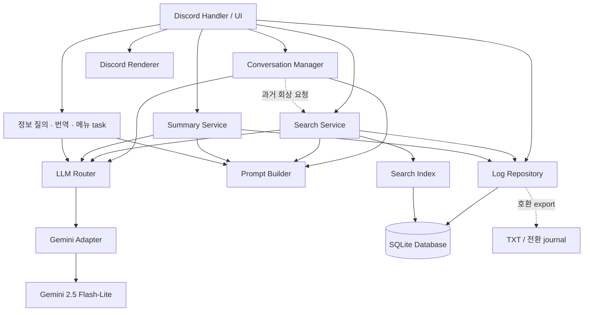
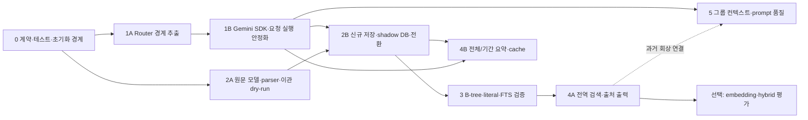

# Choi_bot 구조 재검토 및 개선 설계

작성일: 2026-09-21 (Asia/Seoul). 분석 기준: `main`, `66ecf42dce1894868b98ab59b716899dd8cd9aba`.

이 문서는 **구현 전 설계**다. 확인된 현재 동작과 향후 제안을 구분한다. 이번 변경은 이 문서 추가뿐이며 소스·프롬프트·환경 변수·로그·컨테이너를 변경하지 않았다. DB/인덱스 생성, 로그 변환, 모델 다운로드, Discord 전송, 외부 LLM 호출, commit/push를 수행하지 않았다. 공식 기술 문서 조회는 수행했다.

기존 동작의 상세 설명은 [CURRENT_ARCHITECTURE.md](CURRENT_ARCHITECTURE.md), 기존 문제 ID는 [CODEBASE_AUDIT.md](CODEBASE_AUDIT.md)를 참조한다. [IMPROVEMENT_ROADMAP.md](IMPROVEMENT_ROADMAP.md)는 과거 제안이다. **이번 작업의 범위와 구현 순서는 이 문서 및 최신 사용자 지시를 우선**한다. 기존 보안 정책 변경은 이 계획의 선행 조건이 아니다.

## 1. 핵심 결정과 확인 기준

### 1.1 권장 결정

1. 생성 모델은 계속 `gemini-2.5-flash-lite` 하나를 사용한다. Router는 정적 task 정책과 Gemini Adapter 하나로 시작한다.
2. Router 계약 추출과 `google-genai` SDK 이전은 별도 변경으로 검증하되, 전역 client 경쟁을 없애는 SDK 이전까지 Phase 1의 완료 범위로 권장한다. 모델 변경과 SDK 변경은 서로 다른 작업이다.
3. 단일 Python 프로세스·Docker를 유지한다. 영속 저장은 SQLite를 우선한다. 외부 DB 서버, 메시지 브로커, Vector DB는 초기 구성에 넣지 않는다.
4. 날짜별 TXT를 과거 원본으로 삼는다. 사용자별 합본·백업을 새 메시지처럼 합산하지 않는다. 과거에 없는 Discord ID와 채널 정보는 NULL로 유지한다.
5. 검색은 정확한 문자열/기간/화자 조회부터 구현한다. FTS5는 보조 색인이다. 한국어 1~2글자 부분 문자열을 trigram 검색에만 맡기지 않는다.
6. 검색 결과의 시각·화자·인용·링크는 저장소에서 렌더링한다. LLM은 근거를 설명하며, 원문 메타데이터를 새로 작성하지 않는다.
7. 전체 날짜 요약은 해당 범위 전체를 처리한다. 관련 검색 결과 top-k를 전체 날짜의 대표 자료로 사용하지 않는다.
8. 실시간 메모리는 채널/스레드별 **공유 단체 컨텍스트**로 발전시킨다. 사용자별 1:1 세션으로 바꾸지 않는다. DB 이관보다 먼저 전면 개편할 필요는 없다.
9. 관계·별명·배경 설정은 캐릭터의 핵심 데이터로 보존한다. 먼저 구성과 평가를 분리하고, 선택적 주입은 품질 평가 후 적용한다.

### 1.2 코드 및 운영 확인

분석 시작 시 작업 트리는 깨끗했고 로컬 `HEAD`와 `origin/main`은 일치했다. 같은 대화의 앞선 분석에서 실제 원격 main도 같은 커밋임을 확인했다. 이번 문서 작업에서 원격 ref를 변경하지 않았다. HEAD는 분석 문서만 추가한 커밋이며 실행 소스는 `caec19b` 이후 변경되지 않았다.

직접 읽은 범위: `choi_bot.py` 전체 1,347줄, 위 문서 3개, `requirements.txt`, `Dockerfile`, `run.sh`, `restart.sh`, `.gitignore`, `README.md`, `auto_restart.py`, `logs_bak/clear.py`. `ini.env`의 값은 열람·기록하지 않았다. `auto_restart.py`는 Git 추적 중인 개발 도구이며 Docker 진입점이 아니다. 백업 정리 스크립트는 실행하지 않았다.

| 항목 | 이번에 관측한 사실 | 설계에 주는 의미 |
| --- | --- | --- |
| 주 코드 | 이벤트·LLM·저장·UI·20개 명령이 한 파일 | 책임 경계부터 만들고 명령 이름은 유지 |
| 운영 소스 | 컨테이너 `/app/choi_bot.py`와 작업 파일 SHA-256 동일: `565417cafa0df93a0c6e8d1101ba26d0a8d9a94273f75859c472d3fa9369fa15` | 컨테이너 파일을 포함한 동일 기준 검토. 실행 중 객체의 메모리 상태까지 검사한 것은 아님 |
| 운영 실행 | `python -u choi_bot.py`, restart `always`, 시작 시각 `2026-07-22T08:03:49Z` | 진입점 유지 가능. 향후 종료 시 writer/client 정리 필요 |
| 저장 mount | 호스트 `logs`만 `/app/logs`로 bind | DB를 임의의 `/app` 파일에 두면 컨테이너 교체 시 유실 가능 |
| 운영 버전 | Python 3.11.15, discord.py 2.7.1, google-generativeai 0.8.6, dotenv 1.2.2, google-api-core 2.30.2 | 개발·운영 기준을 명시하고 고정할 필요 |
| 호스트 버전 | Python 3.10.12, 앞선 패키지 조회에서 Gemini SDK 0.8.5 / discord.py 2.5.2 | 호스트 테스트만으로 운영 호환성을 판정하지 않음 |
| SQLite | 호스트 3.37.2, 운영 3.46.1. 운영 라이브러리의 `ENABLE_FTS5` 활성 확인 | 같은 Python 코드여도 SQLite 기능·수정판 차이를 검증 |
| CPU | ARM64 Neoverse-N1, 4코어 | x86 AVX 최적화를 전제하지 않음 |
| 메모리·디스크 | RAM 약 23GiB, available 약 14GiB, swap 없음. 해당 디스크 여유 약 107GiB | SQLite 규모에는 여유. embedding 동시성은 제한 필요 |
| 봇 자원 | 한 시점 CPU 0.01%, 메모리 153.5MiB, PIDs 9 | 부하 시험 결과가 아닌 순간 관측값 |
| GPU·제한 | `nvidia-smi` 없음, 컨테이너 GPU DeviceRequests 없음. Docker CPU/메모리 명시 제한 없음 | GPU 이용 가능하다고 가정하지 않음. 물리 GPU 부재를 완전히 증명한 것은 아님 |

초기 구조는 루트의 실행/배포 파일, `docs/`, `logs/`, `logs_bak/`, `.git/`, 비어 있는 `.agents/`·`.codex/`다. 테스트·DB·검색 인덱스·요약 캐시는 없다. 로그는 실행 중 계속 증가하므로 아래 통계는 2026-09-21 읽기 시점의 파일별 관측치이며 전체 파일을 동시에 동결한 snapshot은 아니다.

### 1.3 현재 데이터 실측

| 구분 | 파일 수 | 크기 | 형식 검사 결과 |
| --- | ---: | ---: | --- |
| 날짜별 `logs/YYYY-MM-DD.txt` | 536 | 28,900,778 bytes | 2025-03-10~2026-09-21, 물리적 520,017줄, 헤더 후보 506,303개 |
| 사용자별 `logs/*_all.txt` | 11 | 23,800,095 bytes | 426,713줄, 모두 헤더 형태. 여러 줄 본문을 완전하게 보존한 자료가 아님 |
| 날짜별 `logs_bak/*.txt` | 70 | 3,508,873 bytes | 2025-03-10~2025-06-01, 헤더 후보 54,381개 |
| 기타 백업 파일 | 2 | 별도 | 확장자 없는 `2025-03-14`는 0 bytes, `clear.py`는 정리 도구 |

현재 parser는 날짜별 파일에서 489,379줄만 취한다. 빈 본문 헤더 16,924개, 비어 있지 않은 비헤더 8,627줄, 빈 줄 5,087줄은 현재 검색·요약 입력에서 빠진다. 헤더 후보 수는 이관 후 확정 메시지 수가 아니다. 사용자가 본문에 로그 같은 줄을 붙여 넣은 경우가 있을 수 있다.

중복 검사는 메시지 내용을 출력하지 않고 SHA-256과 출현 횟수로 비교했다. 헤더부터 다음 헤더 직전까지 묶은 원시 레코드의 **다중집합** 비교에서 백업 54,381개 모두 날짜별 원본에 포함됐고, 합본은 426,713개 중 425,469개가 완전히 일치했다. 앞선 헤더 줄 비교에서는 합본 헤더 전부가 날짜별 파일에 존재했다. 합본의 나머지 1,244개를 신규 메시지라고 판단하면 안 된다. 여러 줄 누락·레코드 경계 차이를 먼저 조사해야 한다.

날짜별 파일 자체에도 동일 원시 레코드의 반복 출현 203개가 있다. 동일 사용자가 같은 초에 같은 내용을 두 번 보낸 경우와 중복 수집을 구분할 ID가 없다. **내용 hash만으로 전역 중복 삭제하지 않는다.** 파일 내 시각이 뒤로 가는 인접 경계도 2개 관측되어 원문 순서와 시각 정렬을 별도로 보존해야 한다.

## 2. 현재 실행 경계와 호환성 기준

### 2.1 데이터 의존성

| 코드 위치 (`choi_bot.py`) | 입력 → 처리 → 출력 | 추출할 책임 |
| --- | --- | --- |
| 201~222, 292~305, 1347 | 환경 → 전역 SDK/client 생성 → 즉시 실행 | 설정 검증, 명시적인 `main()`과 구성 주입 |
| `on_message():544`, `reply():517` | 메시지 저장 → 허용 채널 → 화자 매핑 → 컨텍스트 → LLM → 출력/침묵/초기화 | Discord event DTO, Conversation Manager, Prompt Builder, renderer |
| `update_context():379`, `is_alive():390`, `clear_context():399` | 전역 deque/set/time 변경, 초기화 시 Discord 전송 | 상태 전이와 알림을 분리 |
| `generate_content_timeout():255`, `conf_next():247` | 전역 모델 선택 → executor → text 접근/예외 | Router와 Gemini Adapter |
| `save__logs():307`, `get_latest_log_lines():317` | 로컬 시간·문자열 → 날짜 파일, 마지막 물리적 줄 조회 | Log Repository, TXT 호환 출력 |
| `summary():726` | 파일 선택·파싱·청킹·생성·retry·진행 UI·최종 출력 | reader/query, chunker, Search/Summary Service, progress callback |
| `send():349`, `loading():370` | 최초 응답/defer/원 응답 수정/채널 전송 | Discord 응답 수명·분할 출력 |
| `on_ready():424`, loops 435~500 | 명령 sync·presence·task 시작 | 시작/재접속/종료 lifecycle |

현재 공유 범위는 프로세스 전체다. deque의 20개는 20회 문답이 아니라 사용자·봇 항목 합계다. `active_users`는 참여 허가 목록이 아니며 봇 이름도 포함된다. 활성 상태에서 타 사용자 발언도 처리하는 것은 유지할 기능이다. 별도 채널까지 같은 맥락에 들어가는 부분은 Phase 5에서 분리한다.

### 2.2 LLM 호출 지점 전수표

모든 호출은 현재 같은 Gemini 모델을 사용한다. 캐릭터 프롬프트는 2,204자이고 문답 형태 few-shot 예시는 없다. 현재 문자열 프롬프트 자체를 먼저 고정한 후 호출 경계만 바꾼다.

| 호출 위치 | task_type 제안 | API 전에 만드는 데이터 / 프롬프트 | API 이후 처리 | 현재 정상 호출·RR |
| --- | --- | --- | --- | --- |
| `on_message():569` | `chat` | 화자 매핑, 사용자 항목 append, 캐릭터 전체+새 대화+질문 | `reply()`가 종료/침묵 판정, 저장·context 갱신 | 1, conf_next 있음 |
| `on_message():595` | `chat` | 사용자 append 후 전체 전역 context+동일 최신 질문을 재삽입 | 위와 같음 | 1, 있음 |
| `질문():936` | `qa_short` | `USER`로 prompt 저장, 캐릭터 전체를 말투만 참고, 00100 금지 | Q/A 문자열 전송·로그, context에는 넣지 않음 | 1, 없음 |
| `알려줘():965` | `qa_brief` | 위와 유사, defer·진행, 최대 2줄 지시 | Q/A 공개 출력·경과 시간·로그 | 1, 없음 |
| `자세히():1001` | `qa_detail` | USER 로그, 독립 음슴체/자세한 정보 지시, 캐릭터 전체 없음 | Q/A·시간·로그 | 1, 없음 |
| `summary():799`, flag=0 | `summary_map` | 날짜 파일에서 첫 줄만 파싱, 시간 HH:MM·현재 이름 매핑, 4,000자 청크 | 부분 결과 list append 후 진행 메시지 수정 | 청크별 1, 있음 |
| 같은 위치, flag=1 | `search_legacy_map` | 같은 청크+검색어, 관련 내용 요약 또는 내용없음 | 부분 결과 list | 청크별 1, 있음 |
| `summary():855` | `summary_reduce` / `search_synthesis` | 부분 결과 전체 연결, 검색일 때 검색어 포함 | 최종 text, flag 재사용, 출력·시간 | 1, 있음 |
| `menu_recommand():1075` | `menu_candidates` | 점심/저녁·요청사항 → 후보 15개 | text를 두 번째 입력에 넣음 | 1, 없음 |
| `menu_recommand():1099` | `menu_select` | 후보+요청사항 → 5개 선택 | 원 응답 수정, 결과만 로그 | 1, 없음 |
| `TranslateView.translate_callback():1215` | `translate` | View의 원문·목표 언어+병음/히라가나 규칙 | 원 응답 수정, 로그 저장 없음 | 버튼당 1, 있음 |

코드 호출 지점은 10개이며 flag에 따라 용도가 나뉜다. 기타 LLM 호출은 없다. Search Service 전환 후 `search_legacy_map`은 호환 기간 종료와 함께 제거 가능하지만 명령은 유지한다. 점심·저녁의 두 번 생성은 우선 보존하고 한 번으로 줄이는 최적화는 별도 비교한다.

### 2.3 20개 명령 및 부가기능 보존 목록

| 범위 | 유지할 외부 동작 | 구조 변경 때 확인할 연결 |
| --- | --- | --- |
| `/test`, `/정보`, `/후앰아이`, `/패치노트`, `/언제와` | 고정 메시지·설정·경과 시간 출력 | renderer와 시작 시각. `/정보`는 이미 '봇 실행 시각'이라고 표시함 |
| `/로그 n` | 최신 날짜의 마지막 1~100 **물리적 줄**을 코드 블록으로 출력 | DB record n개로 조용히 바꾸지 않음. TXT exporter 유지 또는 별도 UX 변경 결정 |
| `/config command value? args?`, `/유저 option? user_name?` | 기존 관리자 검사·매핑 기능·인수 | 매핑 표시와 identity resolver 구분. 기존 help/미사용 인수는 별도 결함으로 기록 |
| `/stop` | 현재는 전역 초기화 | 채널 분리 뒤 범위는 사용자 결정 사항. 권한 정책은 바꾸지 않음 |
| `/질문`, `/알려줘`, `/자세히` | prompt 인수·Q/A·상세도 차이 | Router는 같아도 task prompt가 달라야 함 |
| `/요약 date`, `/찾기 date find` | 기존 날짜 입력과 결과 설명·진행·소요 시간 | 날짜 선택형 검색으로 확장 시 기존 입력 호환. `/config summary False`는 둘 다 중지 |
| `/점메추 message?`, `/저메추 message?` | 요청사항 반영, 5개 메뉴 출력 | 공유 `menu_recommand()`; help 경로의 누락 return은 별도 수정 |
| `/번역` | 4개 언어·500자 입력·300초 View·병음/히라가나 | View별 공유 상태 유지 여부와 별개로 요청 snapshot 필요 |
| `/알림 role`, `/해제 role` | 역할 자동완성·부여/해제·현재 응답/권한 방식 | whitelist 정책을 이번 계획에서 바꾸지 않음 |
| `/공지 title content` | 기존 고정 채널·멘션 정책·스레드·링크 안내 | 24시간 자동 보관, 명령 초기 defer와 followup 경로 |
| 주기 알림·활동 상태 | 12시간 정보, 1시간 자세 알림, 기존 presence | 자세 알림은 offline 이외의 non-bot 회원. 중복 task 시작 방지 |

현재 수집 범위, 다른 bot/webhook 취급, 명령 접근 정책은 그대로 설정에 명시한다. DB에 channel ID가 생긴다는 이유로 기존 접근 정책을 자동 변경하지 않는다. 반대로 channel을 모르는 과거 자료를 현재 채널의 발언으로 표시하지도 않는다.

## 3. 구조적 개선 항목 통합표

우선순위는 보안 심각도가 아닌 **이번 구현의 의존성**이다. P1=해당 단계의 완료 조건, P2=다음 기능 도입 시 필요, P3=측정 후 최적화. 난이도는 상대적인 낮음/중간/높음이다. 분류는 결함, 의도된 동작의 변경, 최적화, 도입 제약을 구분한다. 기존 항목은 기존 ID를 재사용하고 같은 문제를 SR ID로 다시 만들지 않았다. CB-002~006·013·021의 보안 패치는 이 표의 실행 대상으로 삼지 않는다.

| ID | 영역·분류 | 현재 구현 | 개선 필요성 | 실제 발생 가능한 상황 | 관련 함수 및 파일 위치 | 제안하는 개선 방향 | 선행 작업 | 영향받는 기능 | 우선순위 | 난이도 |
| --- | --- | --- | --- | --- | --- | --- | --- | --- | --- | --- |
| [CB-001](CODEBASE_AUDIT.md#cb-001) | 단체 맥락·범위 변경 | 전체 프로세스 공유 | 채널 경계만 분리하고 공동 대화 보존 | X의 게임 질문에 Y의 영화 대화가 섞임 | choi_bot.py:339~410,544~615 | 채널/스레드별 deque+epoch, 참가자 공유 | event DTO·대화 회귀 | 일반 대화·stop·만료 | P2/Phase5 | 중간 |
| [CB-007](CODEBASE_AUDIT.md#cb-007) | 응답 대상·개선 | 활성 시 모든 발언에 생성 요청 | 응답 빈도·비용을 조절하되 후속 질문을 놓치지 않기 | B의 '무슨 게임?'은 답하고 B→C 대화는 관찰 | is_called:414,on_message:544 | 직접 호출 신호+보수적 관찰/판정, unknown이면 단체 대화 유지 | 품질 fixture | 일반 대화 | P2/Phase5 | 높음 |
| [CB-008](CODEBASE_AUDIT.md#cb-008) | 프롬프트 경계·결함 | 지시·로그·캐릭터를 한 문자열에 삽입 | 검색 근거와 실행 지시, 출력 제어를 분리 | 과거 발언 속 지시를 요약 규칙으로 읽음 | 134~199,569~607,772~849 | Prompt Builder의 데이터/지시 구분; 근거는 검증할 데이터 | Router 계약 | 대화·검색·요약 | P2 | 중간 |
| [CB-009](CODEBASE_AUDIT.md#cb-009) | 동시성·결함 | 전역 model/context, await 뒤 무조건 적용 | 요청별 client 및 결과 적용 대상 고정 | stop 후 이전 결과가 맥락을 되살림, 응답 역전 | 226~287,379~410,517~615 | key lease·불변 입력·epoch guard·채널별 worker | 초기화 분리·fake clock | 모든 LLM·대화 | P1/Phase1 | 높음 |
| [CB-010](CODEBASE_AUDIT.md#cb-010) | timeout·결함 | wait_for만 20초, SDK는 계속 실행 가능 | 실제 실행 수와 전체 대기 예산 제한 | timeout 후 살아 있는 요청과 새 요청 누적 | generate_content_timeout:255 | native async+transport timeout+전체 deadline; 취소 결과 별도 기록 | Adapter | 모든 LLM | P1/Phase1 | 중간 |
| [CB-011](CODEBASE_AUDIT.md#cb-011) | 검색·구조 제약 | 모든 날짜 청크를 생성형 검색 | 원문 근거·전체 기간·최초 검색 필요 | '없음' 환각, 날짜·화자 손실 | summary:726~906 | DB retrieval→원문 묶음→선택적 synthesis, citation 검증 | 원문 repository·색인 | 찾기·주제 요약 | P1/Phase4 | 높음 |
| [CB-012](CODEBASE_AUDIT.md#cb-012) | 요약·결함/최적화 | 4,000자 절단·매번 재생성 | 완전한 범위·경계·재사용 필요 | 핵심 내용이 청크 경계에 잘리거나 반복 요청 비용 | summary:741~885 | record/token 청킹·범위 manifest·부분 캐시 | repository·Router | 모든 요약 | P1/Phase4 | 높음 |
| [CB-014](CODEBASE_AUDIT.md#cb-014) | interaction·결함 | defer 후 공통 send는 channel.send | 긴 작업의 결과와 진행 응답 수명 명확화 | 결과 전송 후 처리중 표시 잔존 | send:349,loading:370,질문:933 | 최초 응답/defer/edit/followup/channel을 명시적으로 분리 | 출력 계약 fixture | 20개 명령·번역 UI | P1/Phase1 | 중간 |
| [CB-015](CODEBASE_AUDIT.md#cb-015) | 출력·결함 | 대부분 길이 지시만; 제목 제외 길이 판단 | 원문·메타데이터를 포함한 분할 필요 | /로그의 짧은 줄 다음 2,200자 줄이 분할되지 않음 | 로그:647~661,reply:517,summary:857~884 | 공통 Markdown/인용 renderer, 제목 포함 한도 검사 | 출력 fixture | 대화·정보·검색·로그 | P1/Phase1 | 중간 |
| [CB-016](CODEBASE_AUDIT.md#cb-016) | retry·결함 | wrapper×summary×SDK 재시도 | 서비스별 독립 retry 제거 | 청크당 최대 36회 SDK 호출에 내부 시도까지 추가 | 255~287,768~870; 운영 SDK transport | Router가 논리 retry 단독 소유, SDK attempts 제한 | Adapter 오류 매핑 | 모든 LLM | P1/Phase1 | 중간 |
| [CB-017](CODEBASE_AUDIT.md#cb-017) | identity·결함 | username 매핑, USER 익명 로그 | 신규 ID와 과거 별칭을 분리 | 매핑 수정으로 과거 발언자 표시·캐시 내용 변경 | USER_MAP:61,config:689,summary:753,질문:935 | 원 이름 snapshot+확인된 actor 연결+alias version | 공통 record | 검색·요약·대화·유저 | P1/Phase2 | 중간 |
| [CB-018](CODEBASE_AUDIT.md#cb-018) | 저장·결함 | 무구조 TXT, multiline·전달 상태 손실 | 원문·출처·실제 발언과 생성물 구분 | 숨긴 00100이 발언으로 검색됨; 전송 후 파일 오류 | save__logs:307,reply:521~539,정보명령:935~1022 | 구조화 record·generation 분리·writer·출처와 전달 상태 | 스키마·수집 경계 | 로그·모든 기록 기반 기능 | P1/Phase2 | 높음 |
| [CB-019](CODEBASE_AUDIT.md#cb-019) | lifecycle·결함 | ready마다 task.start | 재접속과 초기화를 분리 | 재접속 시 이미 실행 중인 loop 시작 오류 | on_ready:424 | 한 번 생성·재접속 guard·정상 종료 | main 분리 | 알림·만료·DB writer | P1/Phase2 전 | 낮음 |
| [CB-020](CODEBASE_AUDIT.md#cb-020) | 비동기 작업·결함 | loop 오류 관측·정리 불충분 | 새 writer/index job까지 관리할 경계 | 주기 작업 종료를 운영자가 모름 | tasks:435~500 | task 등록·완료/실패 관측, 제한된 복구, 종료 drain | lifecycle | 주기 작업·저장·색인 | P1/Phase2 | 중간 |
| [CB-022](CODEBASE_AUDIT.md#cb-022) | 초기화·결함 | key[0] 사용 후 검증 | import·설정 검사에 외부 실행 불필요 | 키 없는 테스트에서 시작 전 IndexError | 201~222,1347 | Settings 검증 후 client 생성, main guard | 없음 | 시작·Router 테스트 | P1/Phase0 | 낮음 |
| [CB-023](CODEBASE_AUDIT.md#cb-023) | 의존성·도입 제약 | legacy SDK·버전 미고정·환경 차이 | 명시적 client, 재현 가능한 검증 | host에서는 통과하고 Docker에서는 다른 SDK 동작 | requirements.txt, SDK import:6 | 운영 버전 기록·고정, Adapter 뒤 SDK 별도 이전 | Router 계약 | 모든 LLM·배포 | P1/Phase1 | 중간 |
| [CB-024](CODEBASE_AUDIT.md#cb-024) | 검증·결함 | 자동 회귀 없음 | 대화·검색 품질과 동작 변경을 분리 판정 | key 추출 변경이 번역·메뉴 호출을 누락 | 프로젝트 전체 | 가짜 Discord/provider/clock, 고정 입력·출력 계약 | 순수 경계 추출 | 전체 | P1/Phase0 | 중간 |
| [CB-025](CODEBASE_AUDIT.md#cb-025) | 모듈 구조·결함 | import 부작용·전역 상태 집중 | 독립 검증·서비스별 개발 필요 | parser 테스트를 위해 import했는데 봇 시작 | choi_bot.py 전체 | composition root·서비스·adapter·repository 경계 | Phase0 | 전체 | P1 | 중간 |
| [CB-026](CODEBASE_AUDIT.md#cb-026) | 보조 명령·결함/정리 | help 미전송·메뉴 help 후 계속 실행·stale nowmodel | 경계 추출 중 기능 누락 방지 | 도움말 요청이 LLM 비용을 발생시킴 | 유저:1050,menu:1064,nowmodel:42 | 명령 계약 검증, 모델 표시는 실제 response metadata | 명령 fixture | 유저·메뉴·진행 UI | P3 | 낮음 |
| [CB-028](CODEBASE_AUDIT.md#cb-028) | 운영·도입 제약 | logs만 mount, 종료·복구 절차 부족 | DB·WAL·파생 데이터의 수명 보장 | 컨테이너 재생성 뒤 DB가 없어짐 | Dockerfile:15,run.sh:5,restart.sh:12 | 향후 DB 디렉터리 영속 mount·backup/restore·writer drain | DB 경로 결정 | DB·색인·캐시·배포 | P1/Phase2 | 중간 |
| SR-001 | 처리/진행 UI 결합·추가 결함 | 부분 결과 append와 notation.edit가 같은 try | 성공한 생성을 UI 오류로 재생성하지 않기 | 청크 성공 후 진행 edit 실패→결과 중복 append | summary:799~814 | 생성 결과 저장과 progress callback 오류 분리; chunk ID별 upsert | 서비스 추출 | 찾기·요약 | P1/Phase1 | 낮음 |
| SR-002 | 결과 완전성·추가 결함 | 실패 청크 건너뜀, 최종 변수 미할당 가능, flag에 길이 상태 혼용 | 실패·부분 결과·정상 결과 구분 | 일부 로그 누락을 전체 요약으로 안내; 긴 검색이 요약 제목 | summary:815~887 | completed/partial/failed와 coverage manifest; 출력 모드 불변 | SummaryResult 계약 | 찾기·요약 | P1/Phase4 | 중간 |
| SR-003 | 번역 View·추가 결함 | 요청 prompt는 과거 state, 결과 라벨은 await 뒤 현재 self 값 | 같은 UI를 공유해도 입력/출력 대응 보장 | 번역 중 언어 변경→영어 결과를 일본어로 표시 | translate_callback:1200~1217 | View revision과 원문/언어 snapshot, 동시 버튼 정책 | fake UI | 번역 | P1/Phase1 | 낮음 |
| SR-004 | quota 단위·추가 제약 | 키 목록만 있으며 프로젝트 단위 정보 없음 | 키 회전과 quota 회복은 다름 | 같은 프로젝트 키 6개를 바꿔도 동일 429 | API_KEYS:203,rotate:226,공식 rate limits | quota_group별 제한·cooldown, 실제 attempt 계수 | 키의 project 관계 확인 또는 보수적 unknown group | 모든 LLM | P1/Phase1 | 중간 |
| SR-005 | 원본 선택·추가 결함 위험 | 날짜·합본·백업이 같은 폴더 계층에 존재 | 전역 이관의 중복·원문 축약 방지 | glob txt 전체를 넣어 발언 수가 부풀고 최초 시각 왜곡 | logs/,logs_bak/,summary:734 | 날짜 원본 우선·출처 다중집합 대조·재실행 key | inventory·parser | 마이그레이션·검색·요약 | P1/Phase2 | 높음 |
| SR-006 | 입력 구성·추가 결함/최적화 | 최신 발언 중복, 정보 task에 대화 제어 규칙도 포함 | 화자 강조 왜곡·불필요한 침묵 지시 충돌 감소 | 짧은 질문이 두 번 들어가 반복 응답 유도 | on_message:594~603,질문:937~942 | 메시지 1회 삽입, task별 composition; 품질 비교 후 적용 | Prompt Builder·baseline | 캐릭터·정보 질의 | P2/Phase5 | 중간 |
| SR-007 | 색인 적합성·도입 제약 | 검색 인덱스 없음 | 짧은 한국어·원문 일치·최초 순서를 보장 | '토리', '군대', '로아'를 trigram MATCH만으로 조회해 누락 | 향후 index; 현재 summary:741~763 | 짧은 literal scan+필터, FTS 보조, recall 회귀 | corpus·정답 query set | 전역 검색 | P1/Phase3 | 중간 |
| SR-008 | DB 런타임·도입 제약 | 운영 SQLite 3.46.1 | 새 WAL 설계의 지원판·내구성 확인 | 향후 병렬 checkpoint/write 조건에서 알려진 WAL-reset 결함 | 운영 SQLite,향후 repository | WAL 활성 전 수정판 선택·검증, writer/checkpoint 한 소유자 | DB 운영 준비 | DB·캐시·색인 | P1/Phase2 | 중간 |

추가 근거: AST로 분리한 순수 함수와 합성 입력만 실행해 RR이 `0,0,0,1,1,1,1,2`임을 확인했고, `/로그` 분할 루프에 `['short', 'x'*2200]`을 넣으면 길이 `[5,2200]`이 나오는 것을 확인했다. 봇 모듈 자체는 import하지 않았다. concurrency·번역·요약 실패 시나리오는 제어 흐름에서 확인한 가능성이며 실제 운영 장애 발생 이력을 주장하지 않는다.

기존 문서 정정: CB-007의 '매 발화마다 답한다'는 '매 발화마다 LLM을 호출한다'가 정확하다. 00100은 침묵한다. CB-027은 이미 시작 시각 라벨이 있으므로 사용자 표시 오류로 우선 처리하지 않는다. SDK 내부 retry와 합본의 원문 누락은 기존 문서보다 구체화한 내용이다.

## 4. LLM Router와 Gemini Adapter 설계

### 4.1 최소 책임과 계약

`LLMRouter.generate(request) -> LLMResponse` 하나로 시작한다. 실패는 `LLMError` 계열 예외로 통일하여 성공 response와 error 필드가 동시에 존재하는 모호함을 피한다. Discord 객체·메시지 전송·로그 검색·캐릭터 종료 판단은 Router에 넣지 않는다. Adapter는 transport를 한 번 시도하고 provider 응답/오류를 정규화한다. Router는 task 정책·선택·deadline·재시도·실행 제한·관측값을 소유한다.

| 계약 | 필드 제안 | 규칙 |
| --- | --- | --- |
| `LLMRequest` | `request_id`, `task_type`, `messages: tuple[ChatMessage]`, `system_instruction?`, `generation?`, `timeout_policy?`, `metadata` | 불변 snapshot. metadata는 primitive 값만. request ID는 논리 요청 내 retry에서 동일 |
| `ChatMessage` | `role: user/assistant`, `text`, 필요 시 `speaker_label` | Gemini role `model`로 바꾸는 것은 Adapter 책임. 여러 사용자를 모두 같은 사람으로 합치지 않음 |
| `GenerationOptions` | `max_output_tokens?`, `temperature?`, `output_schema?` | 최소 공통 부분. 처음에는 기존 미지정값을 유지. unsupported 옵션은 조용히 무시하지 않고 거절 |
| `TaskPolicy` | `provider`, `model`, `attempt_timeout_s`, `total_timeout_s`, `max_attempts`, `priority` | 모든 task의 provider/model은 gemini/현재 모델. handler가 API 이름을 하드코딩하지 않음 |
| `LLMResponse` | `text`, `provider`, `model`, `model_version?`, `usage?`, `finish_reason`, `timings`, `attempt_count`, `request_id` | SDK 객체를 외부로 반환하지 않음. text 없음/차단/절단은 구분 |
| `Usage` | `input_tokens?`, `output_tokens?`, `cached_tokens?`, `total_tokens?`, `observed_or_estimated` | 미제공은 NULL, 0으로 꾸미지 않음. 실패한 요청의 실제 사용량은 모를 수 있음 |
| `LLMError` | `kind`, `retryable`, `provider`, `status?`, `retry_after?`, `quota_group?`, `request_id`, `attempt_metrics` | kind는 timeout/deadline/rate_limit/auth/invalid_request/unavailable/blocked/invalid_response/cancelled 등 |

현재 model을 request마다 지정할 필요는 없다. task→policy 매핑을 Router 설정에 둔다. 향후 검증된 모델 alias override가 필요할 때만 추가한다. 초기에는 동적 점수 기반 라우팅·plugin registry·사용하지 않는 타 provider 클래스·LLM 프레임워크를 도입하지 않는다.

첫 추출에서는 **기존 문자열을 `messages=[user(raw_prompt)]`로 그대로 전달**한다. system instruction/history 재배치는 Phase 5의 별도 품질 변경이다. `00100`과 종료 문구 해석도 Router가 아니라 기존 `reply()`와 그 후속 ConversationDecision decoder에 남긴다. 검색 JSON 형식 검증도 Search Service 책임이다.

### 4.2 deadline, 오류, 동시성

deadline은 monotonic clock으로 계산한다. 전체 예산에는 queue 대기, quota 대기, 모든 attempt, backoff, 응답 파싱을 포함한다. 각 transport timeout은 `min(attempt_limit, remaining)` 이하로 제한한다. 만료 후 새 attempt를 시작하지 않는다. 새 SDK의 `HttpOptions.timeout`은 밀리초이므로 내부 초 단위와의 변환을 Adapter에서만 수행한다. SDK는 최초 시도만 수행하고 내부 재시도는 하지 않는 설정으로 고정하며 Router에서 retry 정책을 적용한다. 정확한 옵션은 고정할 SDK 버전에서 mock transport로 검증한다. [SDK 타입 정의](https://raw.githubusercontent.com/googleapis/python-genai/main/google/genai/types.py)

| 오류 | 권장 처리 | fallback 의미 |
| --- | --- | --- |
| 일시적 rate limit | 구조화 오류·Retry-After 우선, 해당 quota group cooldown, 남은 deadline 확인 | 독립 quota group임이 확인된 키만 대안이 될 수 있음 |
| 일/장기 quota 소진 | 즉시 회전을 반복하지 않음, 회복 시각/운영 설정에 따라 중지 | 같은 프로젝트의 다른 키로 해결된다고 가정하지 않음 |
| timeout·일시 네트워크·일부 5xx | 제한된 attempt와 지수 backoff+jitter | 모델·provider는 그대로, 같은 정책의 재시도 |
| 인증 실패 | 해당 key 비활성/진단, 동일 key 반복 금지 | 다른 유효 key의 시도는 총 attempt 안에서만 |
| 403 | 인증·프로젝트 정책·지역 제한 등을 구분 | 키를 바꾸면 해결된다고 일반화하지 않음 |
| 잘못된 입력·모델·미지원 옵션 | 자동 retry 없음 | 설정 또는 입력 오류로 반환 |
| 차단·빈 후보·잘린 응답 | 정상 text와 구분하여 task가 처리 | 제한 회피를 위한 다른 key/provider 재시도 없음 |
| 취소·오래된 대화 epoch | 취소 전파, 결과 적용 금지 | 취소를 실패로 보고 retry하지 않음 |

단일 공급자이므로 현재 provider fallback은 없다. 실패 시 원문 검색 결과만 보여주는 식의 **기능상 축소 응답**은 Search Service에서 가능하다. 신규 provider 연결은 이 문서의 구현 단계에 포함하지 않는다.

초기 튜닝안은 대화/번역 attempt 20초·총 45초·최대 2회, 요약 개별 생성 attempt 30초·총 90초·최대 3회다. 이는 검증할 제안값이지 현재 관측 성능이나 API 한도가 아니다. 요약 전체 job에는 별도 deadline/호출 예산을 둔다. 완료하지 못한 청크를 partial로 저장·재개할 수 있어야 한다.

전역 LLM 실행 슬롯과 채널별 순서를 구분한다. 초기 전역 슬롯은 보수적으로 2 이하, background job 동시 실행 1 이하를 제안하며 quota가 더 낮으면 그 제한을 우선한다. 무제한 create_task는 금지한다. 긴 요약 job이 슬롯을 통째로 소유하지 않고 청크마다 다시 얻도록 한다. 대화 우선권에 aging을 더해 background 영구 기아도 방지한다. backoff 중에는 transport 슬롯을 놓되 quota 상태는 유지한다. 채널 lock을 이 전역 슬롯으로 대체하지 않는다.

native async 취소도 원격 서버의 연산/사용량 취소를 보장하지 않는다. legacy executor를 잠시 유지한다면 바깥 wait_for 만료만으로 실제 실행 슬롯을 반환하지 않아야 하며, 살아 있는 worker를 추적해야 한다. 이 복잡성을 장기 설계에 남기지 않는 것이 SDK 이전 이유다.

### 4.3 API Key와 사용량

유지: 환경 변수 키 목록, 빈 슬롯 제외, 여러 키 운용, 키 값을 노출하지 않는 식별자. 개선: 요청 시작 때 건강한 key/client를 lease로 고정하고 actual attempt를 센다. 기존 conf_next 호출 횟수와 API 요청 수가 다르고 첫 키 이후 회전 주기도 4회가 되므로 현재 counter를 사용량으로 승계하지 않는다.

`KeyState`는 `key_id`, client, inflight, disabled reason을 가진다. `QuotaGroupState`는 project/model 기준 cooldown·알려진 RPM/TPM/RPD·관측 사용량을 가진다. 상태 선택/갱신에는 짧은 lock만 사용하고 네트워크 await 동안 전역 lock을 잡지 않는다. **Gemini rate limit은 key가 아닌 project 단위**라는 공식 설명 때문에 두 상태를 분리한다. [Gemini rate limits](https://ai.google.dev/gemini-api/docs/rate-limits)

현재 6개 키의 project 관계와 실제 한도는 확인하지 않았다. 사용자가 secret 없이 `key1~6 → quota_group`만 알려주면 설정할 수 있다. 미확인 시 전부 독립이라고 가정하지 않고 보수적인 공통 unknown group으로 처리한다. 로컬 usage는 이 봇의 관측량이며 다른 프로그램의 사용량·재시작 전 사용량까지 포함한 quota 잔액이 아니다.

최소 지표: task/request/attempt ID, key 식별자·quota group, 선택 및 실제 model, queue/transport/total latency, 사용량, 오류 분류, retry 수, 결과 적용/폐기 상태. 모델이 제공한 version이 없으면 비워 둔다. 시작 단계는 구조화 console 지표면 충분하며 별도 관측 서버는 필요 없다.

### 4.4 SDK 이전을 Router와 어떻게 분리할 것인가

운영 legacy SDK 내부 소스에서 `ServiceUnavailable` retry deadline과 기본 timeout이 각각 600초임을 재확인했다. 현재 20초 wrapper와 독립적이다. 공식 문서는 `google-generativeai`를 비활성 유지보수 대상으로 표시하고 `google-genai`를 권장한다. [공식 SDK 상태](https://ai.google.dev/gemini-api/docs/libraries)

권장 순서:

1. Router/Adapter 계약 및 기존 prompt·response fixture를 추출한다. temporary legacy Adapter는 비교 기준이며 이 단계만으로 동시성 해결을 선언하지 않는다.
2. 별도 변경에서 `google-genai`의 key별 명시적 `Client(api_key=...)`와 async API, close lifecycle, timeout/retry·응답 매핑을 구현한다. 모델은 그대로다. [이전 가이드](https://ai.google.dev/gemini-api/docs/migrate), [명시적 client/async API](https://googleapis.github.io/python-genai/)
3. 새 Adapter에 모든 호출을 연결하고 공통 정책을 적용한다. SDK 변경과 프롬프트 재작성, 검색 변경을 같은 변경 묶음에 넣지 않는다.

legacy SDK의 전역 configure를 이름만 Adapter로 감싸는 것은 경쟁을 해결하지 못한다. legacy의 비공개 `_client`를 수정하는 방식도 장기 계약으로 삼지 않는다. 별도 PR/검증은 가능하지만 안정적인 key별 client·cancellation을 확보한 단계까지를 Router 운영 전환의 완료 조건으로 권장한다. SDK 변경 전후 blocked/empty/text/usage/finish reason 및 기본 generation 동작 차이는 실제 연결 검증이 추가로 필요하다.

## 5. 로그 저장소와 DB 설계

### 5.1 기술 선택

| 대안 | 현재 규모에서의 장점 | 한계·운영 부담 | 판단 |
| --- | --- | --- | --- |
| SQLite | 약 50만 헤더·날짜 원본 약 29MB, 단일 host에 맞음. transaction·일반 index·FTS5를 한 파일군으로 관리 | writer는 한 번에 하나. 긴 reader/색인 작업의 경쟁과 backup 필요 | 기본 선택 |
| PostgreSQL | 여러 host writer, 복잡한 동시 분석·운영 확장에 적합 | 별도 서비스·접속·백업·업그레이드. 한국어와 vector 품질 문제는 DB 교체만으로 해결되지 않음 | 다중 instance 또는 SQLite 병목을 측정한 뒤 검토 |
| TXT 유지 | 원본 보관·사람의 열람 쉬움 | ID·revision·색인·정합성·여러 줄 경계 부족 | 과거 원본과 호환 exporter로 유지 |
| JSONL | event ID와 metadata를 가진 append/replay에 적합 | 조회/중복/변경 처리는 별도 색인 필요, 두 원본 관리 주의 | 이관 중 durable journal 또는 export에 적합 |
| DuckDB 등 경량 분석 저장 | 일괄 통계에 유용 | 실시간 bot transaction 저장소와 따로 운영할 근거 부족 | 현재 미도입 |

SQLite는 이 봇의 단일 서버 저장과 잘 맞지만 실제 latency는 이관 후 측정해야 한다. 일반적인 단일 장치·서비스 내 저장 적합성과 동시 writer 제한은 [SQLite 용도 안내](https://www.sqlite.org/whentouse.html)를 참조한다.

DB writer는 asyncio event loop 밖의 **전용 worker/connection 한 개**가 소유한다. `aiosqlite` 또는 작은 전용 thread wrapper 중 하나만 선택한다. bounded queue와 commit 완료 acknowledgement를 제공하고 reader는 짧은 별도 연결을 쓴다. LLM await 중 transaction을 유지하지 않는다. foreign key, busy timeout, schema version migration을 명시하며 대규모 backfill은 작은 batch로 live 기록에 양보한다.

WAL 도입 전 런타임 버전 gate가 필요하다. 현재 운영 3.46.1은 공식 문서가 명시한 WAL-reset 수정판 이전이다. 다중 연결의 동시 write/checkpoint에 관련된 드문 결함이며 현재 TXT 봇의 장애라는 뜻은 아니다. **새 DB를 배포하기 전에 3.51.3 이상 또는 공식 수정 backport가 적용된 런타임인지 검증**한다. 그전에는 WAL 활성화를 전제하지 않는다. 설치 변경은 이번에 하지 않았다. [WAL 동작과 수정판](https://www.sqlite.org/wal.html), [3.51.3 변경사항](https://www.sqlite.org/releaselog/3_51_3.html)

향후 기본은 patched SQLite+WAL, 단일 writer/checkpoint 소유자, 짧은 reader, durable 기록에 `synchronous=FULL`을 검토한다. queue 수락과 영속 commit을 같은 것으로 보고하지 않는다. 메모리 queue만으로 crash 시 무손실이라고 주장하지 않는다.

저장 경로는 향후 `/app/data/choi.sqlite3`와 **디렉터리 전체 bind mount**를 권장한다. DB와 `-wal`, `-shm`을 같은 영속 위치에 둔다. 기존 mount만 활용하려고 DB를 `logs`에 둘 수도 있으나 데이터 역할을 분리하는 편이 명확하다. DB 도입 단계에서만 배포 스크립트에 경로를 추가한다. backup은 실행 중 `.db` 하나를 복사하는 대신 SQLite backup API로 일관된 사본을 만든 뒤 restore 검사를 한다. [SQLite backup API](https://www.sqlite.org/backup.html)

### 5.2 최소 데이터 모델

아래는 설계 필드이며 실행할 DDL이 아니다. 검색·요약 테이블은 해당 Phase에서 추가한다. 모든 테이블을 처음부터 만들 필요는 없다.

| 테이블/객체 | 주요 필드 | 책임·불변 조건 |
| --- | --- | --- |
| `messages` | `record_id INTEGER PK`, `ingest_key UNIQUE`, `source_kind`, `discord_message_id TEXT NULL`, `guild_id/channel_id/thread_id/user_id TEXT NULL`, `actor_id NULL`, `username_raw`, `display_name_snapshot`, `content`, `message_type`, `delivery_state`, `interaction_id NULL`, `command_name NULL`, `reply_to_discord_id NULL`, `generation_id NULL` | 실제 발언/명령 event의 canonical record. Discord ID는 문자열로 보관하며 내부 ID와 구분 |
| messages의 시각 | `occurred_at_utc NULL`, `observed_at_utc`, `source_timestamp_raw`, `source_timezone NULL`, `time_basis`, `time_confidence`, `ingest_seq` | 신규는 Discord created_at와 수집 시각 분리. legacy 헤더는 기록 시각, timezone 미확정 시 UTC를 확정하지 않음 |
| messages의 변경 | `content_hash`, `revision`, `edited_at NULL`, `deleted_at NULL`, `record_status` | 검색·요약 cache invalidation. unknown과 미삭제를 혼동하지 않음 |
| `sources` | `source_id`, `kind`, `relative_path`, `snapshot_sha256`, `snapshot_size`, `captured_at`, `parser_version`, `import_run_id` | 원본 snapshot 식별. 원본의 bytes와 원래 이름 보존 |
| `message_origins` | `record_id`, `source_id`, `byte_start/end`, `line_start/end`, `raw_hash`, `match_method`, `confidence` | 같은 record에 날짜·백업 등 여러 출처를 연결. 검증 가능한 실제 바이트 범위 |
| `import_runs` / `parse_issues` | 진행 offset·결과 수·오류/모호 구간·parser version·검증 상태 | parse 실패를 버리지 않고 원본 범위와 함께 보고 |
| `actors` / `actor_aliases` | 내부 actor ID, 확인된 Discord user ID NULL, alias, 종류, 출처, 유효 기간 NULL, 확인 수준, mapping_version | 캐릭터 등장인물과 Discord 계정은 별개. 이름 같다고 자동 동일인 확정하지 않음 |
| `generations` | generation/request/task ID, model/prompt version, text, control decision, status, usage, latency, input refs | 모델의 생성 결과·숨긴 제어·stale/failed 결과. 실제 발언과 분리 |
| `message_revisions` (필요 시) | record ID, revision, content, event source/time | 수정 전 본문 보존 필요 여부를 결정한 뒤 도입. 우선 최신본+tombstone+revision만으로도 가능 |
| `ingest_journal` 또는 파일 journal | event UUID, payload, committed/replayed 상태 | 전환 중 동일 event 재처리 방지. 대규모 broker 불필요 |
| `summary_artifacts`, `summary_sources` | scope/version/hash, 결과·status·coverage, record/revision refs | 부분·최종 cache, 원문 연결 |
| `search_segments`, `segment_messages` (의미 검색 단계) | segment ID/version, record ID·순서·문자 범위, content hash | vector와 원문 매핑. vector ID를 Discord ID로 쓰지 않음 |

`discord_message_id IS NOT NULL`일 때 유일성을 보장한다. 한 생성 답변이 여러 Discord 메시지로 분할되면 각 실제 전송 메시지를 별도 record로 저장하고 같은 generation을 가리킨다. `source_kind`는 `discord_live/legacy_txt/interaction_event` 등을 구분하고, `message_type`은 `human_message/bot_message/command_input/command_output/legacy_unknown` 등을 구분한다. `delivery_state`는 `observed/sent/unknown` 등이며 generated-only text를 sent로 표시하지 않는다.

모델이 생성했지만 침묵한 결과는 `generations`에 남기고 기본 발언 검색에서 제외한다. legacy의 `최씨 봇: 00100...`은 과거 코드 버전·종료 문구 우선순위를 모두 알 수 없으므로 원본 record를 보존하고 `suspected_control`, 분류 근거·confidence를 붙인다. 단순히 숫자 00100이 들어간 모든 과거 줄을 확정된 비발언으로 삭제하지 않는다. `USER`로 남은 Slash 입력도 실행한 사용자를 지어내 연결하지 않는다.

명령 출력·실제 일반 발언·hidden control을 필터할 수 있도록 하되 과거 unknown을 기본 검색에서 전부 제외해 기록을 사라지게 하지 않는다. 확정 제어 자료는 기본 제외, 불명확한 과거 자료는 유형 불명 표시가 권장값이다. 운영 수집 범위를 넓히는 것은 별도 결정이며 기존에 기록하지 않았던 번역/요약/공지까지 자동 수집하도록 이번 설계가 강제하지 않는다.

신규 event는 저장소와 Conversation Manager가 같은 불변 DTO를 받을 수 있다. DB는 장기 출처·revision·검색을, deque는 현재 참여 흐름·활성 여부·처리 순서를 담당한다. LLM 요청 때마다 DB 전체를 읽거나 deque를 DB로 대체하지 않는다. 프로세스 재시작 후 대화를 복원하는 것도 초기 필수 기능이 아니다.

### 5.3 시각·채널·identity의 한계

- 현재 헤더는 `datetime.now()`의 로깅 시각이고 message.created_at이 아니다. 운영 KST는 확인했지만 2025년 전체 파일의 timezone을 증명하지는 않는다. 이관 manifest에 timezone 가정과 근거를 기록한다.
- 날짜 파일명과 헤더 날짜는 둘 다 보존한다. 잘못된 날짜/역행/파일 경계는 issue로 남긴다. 동일 초 순서는 원본 offset으로 재현하며 이를 실제 Discord 전송 순서라고 단정하지 않는다.
- 과거 guild/channel/thread/message/user ID는 NULL. legacy 파일의 인접 발언은 여러 채널이 섞인 것일 수 있으므로 '동일 채널 대화 복원'으로 표현하지 않는다.
- `USER_MAP`은 검색용 별칭 초기 자료로 활용하되 원 username을 덮어쓰지 않는다. 변경된 mapping version은 캐시와 actor 필터에 반영한다. `choiyeongweon_ → 주효중` 같은 현재 설정을 이름의 인상만으로 수정하지 않는다.
- '최씨'는 봇 캐릭터·인물·계정 중 무엇을 뜻하는지 모호할 수 있다. alias candidate를 제시하거나 해석을 표시하며, 이름이 비슷하다는 이유로 자동 계정 병합하지 않는다.
- 앞으로 edit/delete event를 수집할 경우 Discord cache에 없는 raw event·부분 payload도 고려한다. 모르는 삭제 ID는 tombstone으로 보존하고, 누락 필드를 빈 문자열로 기존 본문에 덮어쓰지 않는다. 과거 수정/삭제 이력은 복원할 수 없다.

## 6. 과거 로그 이관과 운영 전환

### 6.1 reader와 중복 정책

1. **원본 보존 및 inventory**: 날짜 파일·합본·백업·기타를 분류하고 size/hash/mtime/기간을 기록한다. 원본 삭제·정리 스크립트 실행은 하지 않는다. 고정 snapshot 복사본을 별도 보존한다.
2. **snapshot 파싱**: 줄 시작의 유효 timestamp+화자 헤더에서 새 record를 열고 다음 헤더 전까지 줄바꿈·공백을 본문으로 보존한다. 빈 첫 본문도 유효하다. 파일 앞 고아 줄·유효하지 않은 날짜·헤더 같은 본문은 원시 범위와 issue를 남긴다.
3. **손실 없는 원문 대응**: 디코딩 실패는 replacement 문자로 몰래 바꾸지 않는다. UTF-8/CRLF/BOM 처리 정책·byte offset과 line offset을 함께 저장한다. 검색용 Unicode 정규화는 파생 데이터이며 raw bytes는 유지한다.
4. **날짜 파일 우선**: source snapshot+record 시작 offset이 occurrence identity다. raw hash는 대조 수단이며 전역 unique key가 아니다. 같은 초 동일 문장도 원본의 두 occurrence면 보존한다.
5. **합본·백업 연결**: timestamp/화자/전체 본문/출현 순서의 다중집합으로 canonical occurrence에 연결한다. 합본의 잘린 본문은 날짜 원본으로 대체하고 출처 관계만 남긴다. 단순 content set 비교로 병합하지 않는다. 불일치는 별도 검토 대상으로 두고 기본 canonical에 추가하지 않는다.
6. **재실행**: `source snapshot ID + byte_start + raw_hash`에 유일 key. 동일 파일/offset 재실행은 추가 삽입 0. append 파일은 기존 prefix hash와 offset을 확인하고 마지막 미완성 record부터 재파싱한다. 파일이 수정된 경우 새 snapshot으로 보고 기존 source 계보와 매칭한 뒤 적용한다. 파일 전체 hash 변경을 '전체가 새 메시지'라고 해석하지 않는다.
7. **parser 버전 변경**: occurrence 출처를 기준으로 재해석 차이를 계산한다. 새 parser_version을 unique key에 넣어 같은 메시지를 한 번 더 넣지 않는다. 기존 결과는 승인된 reconciliation 후 수정하고 이관 이력은 보존한다.

TXT 형식의 본질적인 모호함 때문에 모든 header 후보의 진위를 자동 확정할 수는 없다. 원문 전체를 재구성할 수 있는 byte 범위 보존과 issue 수 보고를 완료 조건으로 삼는다. '파싱 불가'를 곧바로 버린 데이터로 만들지 않는다.

### 6.2 검증 기준

- 각 snapshot의 전체 bytes가 record/고아 구간/issue 중 하나에 대응하는지 확인한다. record 수만 맞추는 검증으로 끝내지 않는다.
- 파일별 헤더·record·빈 본문·multiline·issue 수와 날짜/화자 분포를 보고한다. 506,303은 이번 검사에서의 후보 수이므로 이 숫자와 억지로 맞추지 않는다.
- 원문 범위 hash 및 재구성 bytes를 비교한다. 최초·최후·빈 메시지·코드블록·동일 초 반복·역행 timestamp를 표본 검증한다.
- 동일 이관을 두 번 실행했을 때 canonical 추가 0, origins의 중복 추가 0을 확인한다.
- 일부 batch 실패 후 재개, 파일 append/수정, 동일 합본 추가, 중간 crash에서 결과가 일관되는지 확인한다.
- `integrity_check`, foreign key 검사, backup→새 파일 restore→조회 일치 검사를 수행한다. 검색 인덱스는 이 검증 이후 별도 구축한다.

### 6.3 새 이벤트와 backfill이 겹치는 전환

일반 TXT와 DB에 각각 한 번씩 쓰는 것으로 원자적 이중 저장이 되지는 않는다. 권장 전환은 다음과 같다.

| 단계 | 원본/조회 상태 | 누락·중복 방지 |
| --- | --- | --- |
| A. parser·DB shadow | 기존 TXT 기록·조회 유지 | 종료된 날짜 snapshot을 먼저 이관. 오늘 파일은 완성된 record prefix까지만 |
| B. 구조화 수집 경계 배포 | 신규 event에 UUID/Discord ID 부여, durable JSONL journal을 DB 이관 기간에 사용. 기존 TXT exporter 유지 | 같은 journal event를 DB와 TXT가 소비. 각각 checkpoint. writer는 commit 전 성공으로 보고하지 않음 |
| C. cutover manifest | legacy 파일별 byte 경계와 첫 신규 event ID 기록 | 이전 경계까지는 legacy, 이후는 구조화 journal. 동일 event의 TXT export 범위도 sidecar/manifest로 연결 |
| D. tail catch-up | A 이후 B 이전의 TXT tail과 B 이후 journal replay | 완료된 prefix를 검증하고 마지막 record 재개. 숫자 timestamp만으로 live/legacy 중복 제거하지 않음 |
| E. shadow 대조 | 조회는 기존 유지, DB 저장 결과 대조 | 일별 건수·원문·export 일치, queue 지연·오류·crash replay 검증 |
| F. DB 조회 전환 | Search/Summary가 DB를 읽음. TXT는 호환·export | rollback 시 TXT reader 사용 가능. 같은 event를 import와 live 경로에서 중복 삽입하지 않음 |
| G. 안정화 후 | DB를 신규 canonical로 권장. legacy TXT 영구 원본, 신규 TXT는 재생성 가능한 export | journal 종료/압축은 DB commit·backup·replay 검증 후 별도 운영 결정 |

B의 writer 순서·cutover 경계는 구현 배포 시 coordinator로 한 번 정한다. 소스 파일만 바꾼 상태에서 운영 프로세스가 자동 전환된다고 가정하지 않는다. 봇 재기동 중 Discord에서 놓친 메시지나 event 수신 전 장애까지 이 설계만으로 무손실 보장할 수 없다. 그 구간은 coverage gap을 기록하며 Discord history backfill은 별도 명시적 작업이다.

bot 출력은 generation과 delivery를 분리한다. 전송 완료로 받은 실제 message ID를 저장하며 self on_message와 전송 hook이 중복 수집해도 ID unique로 결합한다. 전송 timeout은 성공 여부 불명일 수 있어 무조건 재전송하지 않는다. Discord 전송과 SQLite commit 사이에 분산 transaction은 없으므로 상태를 `unknown/pending/sent/failed`로 추적하고 재조정한다. DB 실패를 LLM 재생성으로 해결하지 않는다.

## 7. 검색·인덱싱 설계

### 7.1 조회 유형별 책임

| 유형 | 기본 알고리즘 | 보장·한계 |
| --- | --- | --- |
| 정확 문자열 | raw content에 literal substring 검증 또는 완전 일치 | exact와 정규화 일치를 별도 모드로 표시. LLM 불필요 |
| 키워드 | alias 확장+FTS/BM25 후보+literal 조건 재검증 | 조사·띄어쓰기 변형은 자동 보장되지 않음 |
| 날짜/화자/채널 | B-tree index로 후보 범위 제한 | channel 필터는 legacy NULL을 특정 채널로 간주하지 않음 |
| 최초/마지막 | 필터와 일치 조건을 전체 범위에 적용한 뒤 timestamp·source 순서 정렬 | top-k 관련도 후보의 최소 시각을 최초라고 말하지 않음 |
| 의미/주제 | lexical+선택적 embedding 후보 결합 | 주제의 모든 발언을 찾았다는 보장 없음 |
| 여러 대화 통합 | coverage 범위·근거 묶음별 추출→통합 | 표본 요약인지 범위 전체 분석인지 명시 |
| '지난달 언급 게임들' | 화자·기간의 전체 메시지를 읽고 게임명 후보/근거 추출→정규화·집계 | 관련도 상위 몇 개만 보고 전체 게임 목록이라고 하지 않음 |

`SearchQuery`는 literal/semantic intent, original query, resolved aliases, `[start,end)`와 timezone, actor/channel filters, order, limit, interpretation version을 가진다. 단순 조건은 규칙으로 해석하고 명령 옵션을 우선한다. 자연어 조건 파싱용 LLM은 필요할 때만 한 번 호출하고 결과 schema·날짜 범위·actor 후보를 코드에서 검증한다. SQL 문자열을 모델에게 만들게 하지 않는다.

상대 날짜는 요청 시각과 KST를 기준으로 확정하여 보여준다. 예를 들어 2026-09-21의 '지난달'은 `[2026-08-01,2026-09-01)`, '지난여름'은 기본적으로 2026년 6~8월로 해석하되 사용자에게 범위를 표시한다. '작년 여름'은 2025년 6~8월이다. 다른 해석 가능성을 숨기지 않는다.

### 7.2 단계적 인덱스

1. **B-tree 우선**: `(occurred_at_utc, record_id)`, `(actor_id, occurred_at_utc, record_id)`, 신규 `(guild_id, channel_id, thread_id, occurred_at_utc, record_id)`, source/byte offset. 실제 쿼리의 `EXPLAIN QUERY PLAN`을 보고 과도한 인덱스를 줄인다. NULL timezone legacy의 정렬 key는 별도 해석 정책을 쓴다.
2. **정확 검색 기준 구현**: 필터 후 `instr(content, literal)>0` 등으로 결과를 확정한다. `%`, `_`, 따옴표, MATCH 연산자가 섞인 검색어도 문자 그대로 처리하는 경로를 둔다. 전체 검색이 느리면 결과를 버리는 대신 실행 예산과 페이지/비동기 작업으로 대응한다.
3. **FTS5 보조**: `unicode61`은 한국어 형태소 분석기가 아니다. '토리를'과 '토리'는 같은 token으로 보장되지 않는다. trigram은 부분 문자열에 유용하지만 3글자 미만 MATCH는 찾지 못한다. 따라서 '토리/군대/로아'는 B-tree 필터+literal scan을 필수 fallback으로 둔다. [FTS5 tokenizer](https://www.sqlite.org/fts5.html#tokenizers)
4. **alias/정규화**: `로아↔로스트아크`, 사용자 별명·게임명 사전을 버전 관리한다. NFC·영문 casefold·공백 정규화는 파생 검색 text에만 적용한다. 띄어쓰기 제거 검색은 false positive가 늘므로 별도 완화 검색으로 표시한다. 조사 처리를 위해 형태소 분석/문자 bigram 색인을 도입할지는 정답 세트 누락과 실제 지연을 보고 결정한다.
5. **색인 정합성**: 우선 원문과 FTS를 같은 SQLite transaction에서 갱신한다. external-content FTS를 사용하면 insert/update/delete trigger 또는 repository 한 경로로 유지하고 초기 rebuild·rowid/content hash 검증을 한다. trigger 추가만으로 기존 행이 색인되지 않는다. [FTS5 external-content 주의사항](https://www.sqlite.org/fts5.html#external_content_tables)

초기에는 trigram 색인 하나+literal fallback+alias만으로 시작하고 unicode61/BM25가 실제 query set에서 이득이면 보완한다. BM25와 trigram 검색을 동일한 정확 일치 기준으로 취급하지 않는다. FTS가 반환한 후보는 record ID로 원문을 다시 읽어 필터·revision·일치 조건을 확인한다. host/운영의 SQLite 버전이 다르므로 trigram 기능은 고정 런타임에서 별도 synthetic DB 시험을 할 예정이며 이번에는 인덱스를 만들지 않았다.

### 7.3 선택적 로컬 embedding

embedding은 literal 검색을 대체하지 않는다. 표현이 다른 군대 이야기·레이드 경험처럼 키워드 확장만으로 recall이 부족한 질의에서 도입한다. 생성 모델 선정과 별개인 검색 구성 요소이며 지금 설치하지 않는다.

시험 후보는 MIT 라이선스의 `intfloat/multilingual-e5-small`이다. 한국어를 포함한 다국어 모델이며 384차원, 최대 512 token이고 검색 입력에 `query:`/`passage:` 구분을 사용한다. 한국어 서버 은어 품질은 아직 검증하지 않았다. [제작자 모델 카드](https://huggingface.co/intfloat/multilingual-e5-small/raw/main/README.md)

CPU 실행을 우선하고 ARM64에서 PyTorch/ONNX 패키지와 연산 지원을 확인한다. ONNX/양자화는 후보 최적화이지 무조건 더 빠르거나 품질이 같다는 보장이 아니다. 서버는 x86용 AVX preset 대상이 아니다. [Sentence Transformers 실행 최적화](https://www.sbert.net/docs/sentence_transformer/usage/efficiency.html)

| 단위 | 장점 | 단점·권장 용도 |
| --- | --- | --- |
| 개별 메시지 | 특정 원문으로 바로 연결, 갱신 작음 | 'ㅇㅇ', '그거' 등 짧은 문맥 결핍, vector 수 많음 |
| 작은 대화 구간 | 주제·대명사 문맥 보존, vector 수 감소 | 여러 화자의 주장이 섞일 수 있어 record/문자 범위 연결 필수 |
| 일별 전체/생성 요약 | 개수 적음 | 모델 길이 제한·정보 누락, 원문 검색의 주 색인으로 부적합 |

권장 기본 단위는 embedding 모델 tokenizer로 256~384 token 내의 작은 구간이다. 메시지 경계를 보존하고 긴 단일 메시지는 offset으로 나누며 인접 1~2개 메시지 overlap은 평가한다. 신규 자료는 같은 채널/스레드 안에서, legacy는 source 인접 범위 안에서만 묶되 채널 불명 표시를 유지한다. 검색용 segment와 생성 요약 chunk는 다른 token budget이므로 같은 크기를 강제하지 않는다.

약 506,303개 메시지에 384차원 FP32를 모두 저장하면 원시 vector만 약 742MiB다. model·인덱스·복사·파이썬 객체 메모리는 별도다. 메모리 여유만으로 4코어에서 전체 인코딩과 매 요청 전수 dot-product가 빠르다고 판단할 수 없다. 1,000~10,000개 표본으로 cold/warm latency·처리량·RSS·event loop 지연을 측정한 후 전체 구축을 결정한다. 초기 worker 1개, CPU thread 1~2개, 작은 batch를 제안한다.

초기 vector 저장은 SQLite BLOB+segment/model/version 참조, 조회는 작은 후보/구간 수에서 메모리 배열 또는 memmap의 cosine 비교로 시작할 수 있다. 의미 검색을 lexical 후보 안에만 제한하면 lexical에서 누락한 발언을 복구할 수 없으므로 **semantic 경로는 허용 범위 전체에서 독립적으로 후보를 얻어야 한다.** 전체 scan이 느리면 같은 프로세스의 ANN 또는 SQLite vector extension을 비교한다. 외부 Vector DB는 필요하지 않다.

각 vector는 `segment_id + source_revision_hash + embedding_model_revision + normalization_version + chunker_version`으로 연결한다. 원문 변경/삭제 시 dirty queue에 넣고 조회 시 stale vector를 제거한다. 새 model·차원·정규화로 재생성할 때 새 index generation을 병행 작성하고 검증 후 manifest를 교체한다. 다른 embedding 모델의 vector를 섞어 검색하지 않는다. 파생 색인이 실패해도 DB 원문과 literal 검색은 유지한다.

Hybrid는 lexical/semantic의 순위를 RRF 등으로 합치고 동일 source window를 중복 제거한다. raw BM25와 cosine을 검증 없이 직접 더하지 않는다. 초기 rerank는 literal/화자/기간 일치, source 다양성, 중복 window 억제만 사용한다. cross-encoder/LLM reranker는 CPU·API 비용 대비 top 결과 개선을 측정한 뒤 추가한다. query별 임의 cosine threshold로 '없음'을 확정하지 않는다.

### 7.4 원문 기반 응답 생성

```text
명령 인수·검색어
→ 해석된 SearchQuery와 조회 scope
→ DB 필터 + literal/FTS + 선택적 semantic 후보
→ 원문·revision 재확인 → 중복 제거·순위
→ 같은 출처의 주변 문맥 복원
→ EvidenceBundle
→ 필요할 때만 LLM 정리
→ 검증된 근거 카드 + 설명을 Discord renderer로 출력
```

초기 관련도 질의의 후보 예산은 경로별 최대 100개, 합친 후 검토 30개, LLM에 5~10개 구간을 시작값으로 제안한다. 최종 제한은 token 예산이며 개수 고정이 아니다. 전체 입력 중 prompt·질문·출력 여유를 먼저 빼고 근거에는 예를 들어 6,000~10,000 token을 배정해 평가한다. 원문 token count API를 매번 호출해 비용을 늘리지 않고 로컬 추정+샘플 보정, 가능할 때 provider usage를 사용한다. 초과분은 페이지·추가 조회로 남기며 잘린 범위를 고지한다.

주변 문맥은 신규 자료에서 같은 channel/thread·시간 간격·reply 관계 기준으로 전후 2~5개 메시지부터 확장한다. 필터 밖 다른 사람 발언이 맥락상 포함되면 '주변 맥락'으로 구별한다. legacy는 파일/offset 주변을 가져오고 채널 불명 경고를 붙인다. 관련 구간이 겹치면 합친다. 여러 날짜의 독립 사건을 하나의 연속 대화처럼 붙이지 않는다.

`EvidenceBundle`은 `{evidence_id, record_id, revision, speaker, timestamp, raw_text, source_ref, context_only}`를 가진다. LLM에는 ID가 붙은 자료를 주고 설명 항목별 `evidence_ids`를 요구한다. validator는 다음을 확인한다.

- 반환 ID가 이번 bundle에 실제 존재하고 현재 scope에 속하는가.
- 인용 문자열이 해당 원문/명시된 문자 범위와 일치하는가. 인용문·날짜·화자·링크는 최종적으로 코드가 DB 값으로 렌더링한다.
- legacy 링크가 생성되지 않았는가. legacy 출처는 `파일명:줄 범위`, 내부 record ID, 시각의 가정으로 표시한다. 신규 Discord ID를 실제 확보한 경우에만 jump URL을 제공한다.
- citation이 없거나 invalid하면 그 주장을 빼고 근거 카드만 반환한다. LLM 실패 시 원문 목록을 제공하고 성공한 검색을 실패한 생성 때문에 잃지 않는다.

structured JSON이 사실성을 보장하지는 않는다. 올바른 근거 ID를 달고도 과장된 설명을 쓸 수 있다. exact/최초/날짜 질의는 deterministic 결과를 주 응답으로, 자유 설명은 부가 요약으로 구별한다. 필요하면 원문에 없는 날짜/인물/인용을 포함한 문장을 보수적으로 제외하되 의미적 진실을 완벽하게 자동 검증했다고 주장하지 않는다. [Gemini structured output](https://ai.google.dev/gemini-api/docs/structured-output)

literal 전체 검색의 0건과 semantic 후보가 충분하지 않은 상태는 다르게 안내한다. 전자는 '이 범위에서 해당 문자열 없음', 후자는 '검색된 근거에서 확인 못함'이다. 최초/마지막은 관련도 top-k와 별개로 전체 조건 일치 record를 시간순으로 조회한다. 의미 기반 최초는 전체 주제를 완벽히 판별할 수 없으므로 '찾은 기록 중 가장 이른 사례'로만 표현한다. 보유 기간·coverage gap·시간대 불명을 함께 유지한다.

## 8. Summary Service와 캐시

### 8.1 summary() 분리 경계

현재 함수의 파일/파싱 부분은 Repository+LegacyReader, 4,000자 절단은 Chunker, flag 분기는 SearchService/SummaryService, retry는 Router, notation/loading/send는 Discord handler로 분리한다. 서비스는 Discord 객체 대신 `progress(event)` callback 또는 event iterator를 사용하며 UI 실패로 생성 작업을 반복하지 않는다.

공유 DTO는 `MessageRecord`, `QueryScope`, `SourceRef`, `EvidenceBundle`, `TextChunk`다. SearchResult는 hits/rank/coverage를, SummaryResult는 topics/claims/source refs/coverage/status를 소유한다. 같은 원문 계층을 쓰되 검색 순위와 전체 요약 범위를 같은 함수로 합치지 않는다.

| 요약 종류 | 데이터 선정 | 주의점 |
| --- | --- | --- |
| 날짜/기간 전체 | scope 안의 전체 대상 record를 고정 snapshot으로 조회 | 검색 top-k 사용 금지; 긴 기간은 일/세션 부분 결과 계층 통합 |
| 사용자별 | actor+기간 전체, 필요할 때 주변 발언 별도 태그 | 다른 화자 주장을 대상자의 발언으로 바꾸지 않음 |
| 주제별 | SearchService의 후보·범위 manifest | 검색으로 확보한 근거 범위의 요약임을 표시 |
| 대화 세션별 | 채널·시간 간격 기준 묶음 | 실시간 bot 활성 120초 세션과 분석용 세션은 다른 개념 |

### 8.2 청킹·부분 결과·통합

분석용 세션은 신규 자료의 같은 채널/스레드에서 비활동 10~20분을 초기 후보로 삼고, 급격한 화제 변경은 평가 후 추가한다. 과거 자료는 채널이 없어 시간 간격+원본 인접 기반의 추정 구간이다. 날짜 경계를 가로지르는 세션은 scope에 해당하는 부분과 보조 맥락을 분리한다. 매 세션마다 주제 판별 LLM을 선행 호출하지 않는다.

생성 청크는 메시지 경계를 유지하면서 초기 입력 2,000~4,000 token을 제안한다. prompt·메타데이터·출력 여유를 포함한 전체 budget을 검증한다. 긴 단일 본문은 원문 record와 start/end offset을 유지해 나눈다. 고정 문자/token 환산은 한국어에서 정확하지 않으므로 근사값임을 표시한다. current `4000/C` 출력 한도는 없애고 중요한 사실·대표 인용 보존을 위한 부분 결과 예산을 따로 둔다.

부분 결과는 `chunk_id, source_record_ids+revisions, source_hash, time_range, participant_refs, topics, claims[{text,evidence_ids}], quote_spans, unresolved, status, coverage`로 설계한다. 최종 통합도 같은 evidence ID를 이어받는다. 요약의 요약만 반복하면서 근거를 잃지 않도록 필요한 원문을 재조회할 수 있어야 한다. chunk 실패는 명시적 failed이며 전체 결과는 partial, 성공 chunk 0이면 생성형 최종 요약을 요청하지 않는다.

청크 통합 입력도 커지면 트리 형태의 중간 reduce를 사용한다. 작은 일별 범위는 map C회+reduce 1회이며, 큰 범위는 필요한 reduce node만 추가한다. citation 검증과 coverage 계산은 매 node에서 이어간다. 중복 overlap 자료는 사건 수 집계에서 한 번만 센다.

### 8.3 캐시와 증분

캐시 key는 scope의 canonical 표현·원문 `(record_id, revision/content_hash)` manifest·mapping version·chunker version·prompt hash·generation config·provider/model version·출력 schema version을 포함한다. provider가 실제 model version을 주지 않으면 configured model+운영 cache epoch를 사용하고 완벽한 모델 버전 식별인 것처럼 표현하지 않는다.

부분·최종 결과는 DB 테이블에 저장하고 실패/partial/complete를 구분한다. 동일 key의 동시 요청은 process 내 single-flight로 생성 하나를 공유하고 DB unique key로 중복 artifact를 막는다. 한 interaction의 취소가 다른 대기자의 작업까지 취소하지 않도록 job과 subscriber 수명을 분리한다.

| 변경 | 무효화/처리 |
| --- | --- |
| 동일 입력 재요청 | 완료 cache hit면 LLM 0회 |
| 오늘 새 메시지 추가 | 열린 마지막 세션/청크와 상위 reduce만 재계산 |
| 과거 backfill·시각 정정 | 영향받는 기간·세션 membership·최초 검색 결과까지 revision 갱신 |
| edit/delete | 해당 record를 참조한 부분 결과와 상위 결과 무효화 |
| alias 매핑 변경 | 표시/필터가 영향을 받는 cache key 변경; raw 본문은 유지 |
| prompt/model/config 변경 | 새 namespace. 기존 결과를 출처와 함께 보관할 수 있지만 새 요청에 같은 결과로 재사용하지 않음 |

추가 한 줄 때문에 전체 고정 길이 chunk가 뒤로 밀리지 않도록 종료된 세션·청크는 안정된 ID로 닫고 마지막 열린 구간만 수정한다. 과거 파일도 수정될 수 있으므로 날짜가 지났다는 이유만으로 cache를 영구 불변으로 취급하지 않는다.

처리 시작 시 record/revision manifest를 확정하고 '어느 시점까지의 요약인지' 출력한다. 생성 동안 DB reader transaction을 잡아두지 않고 필요한 snapshot 자료를 읽은 뒤 해제한다. 생성 중 변경이 발생하면 저장 시 재검증하여 stale artifact를 최신으로 게시하지 않는다. 원문이 수정된 경우 재시도 예산 내 갱신하거나 처리 기준 시점을 명시한다.

출력은 현재 날짜 인수·주제/흐름/대표 발언·진행 표시·소요 시간을 유지하되 근거 펼치기/페이지를 추가할 수 있다. 본문 목표 길이와 Discord 전송 한도는 분리하고 제목·인용·출처를 포함해 renderer가 나눈다. 실패 청크 수/분석된 범위가 있는 결과를 완전한 하루 요약이라고 표시하지 않는다.

## 9. 캐릭터와 Prompt Builder

### 9.1 현재 프롬프트에서 유지할 것과 바꿀 경계

현재 캐릭터는 무덤덤·유머·회의적인 반응, 음슴체, 짧은 답변, 가끔 감탄사, 관계에 따른 장난, 게임과 주변인 설정으로 구성된다. 기본 1~2줄, 설명/정리/비교/가이드 3~6줄 규칙이 있다. 인간관계·별명·배경은 삭제하지 않는다. `WHO_AM_I`와 실제 CHARACTER_PROMPT가 별도 문자열이라는 점도 보존·대조한다.

현재 control은 '맥락이 부족하면 00100', 종료 문구, 반복 금지 지시가 persona와 섞여 있다. 사용자가 다른 사람에게 말하는 상황과 단순히 정보가 부족한 상황을 충분히 구별하는 명시적 규칙은 없다. `/질문`·`/알려줘`는 persona 전체를 넣은 뒤 침묵을 금지하여 서로 다른 task 지시가 혼재한다. 연속 대화의 최신 메시지는 두 번 들어가고 숨긴 control도 다음 history에 보인다. 이런 구성은 '그거' 같은 후속 질문의 화자 해석·반복에 영향을 줄 수 있으나 실제 품질 저하 크기는 비교 평가 대상이다.

| 구성 요소 | 일반 대화 | 정보 질의 | 검색/요약 | 번역/메뉴 |
| --- | --- | --- | --- | --- |
| Core Persona | 항상 | 말투를 원하는 task만 | 기본 생략 | 생략 |
| Style | 항상 | short/brief/detail 목적별 | 제목/연결 문장만 선택 가능, 인용 원문은 변경 금지 | 각 task의 기존 스타일 |
| Relationship Facts | 초기에는 전체 유지 | 인물 관련 질문일 때 필요 | 검색 근거로 사용하지 않음 | 보통 생략 |
| Conversation Context | 채널 공유 history | 현재처럼 독립 질의 유지 | 분석 범위의 원문 bundle | 번역 View/메뉴 입력만 |
| Runtime Control | reply/silence/end | 응답 task이므로 silence protocol 없음 | structured evidence schema | task output 형식 |
| Task Instructions | 자연스러운 그룹 대화 | 정확성·상세도 | 근거·coverage·인용 규칙 | 번역/메뉴 조건 |
| Retrieved Knowledge | 과거 회상 의도일 때 선택적 | 과거 로그 질문일 때만 | 직접 근거로 제공 | 보통 없음 |

매 요청마다 persona를 Python 문자열로 재조립할 필요는 없지만 stateless API 요청에는 필요한 지시와 history가 다시 전달되어야 한다. **system instruction으로 옮긴다고 토큰 비용이 자동 사라지지 않는다.** provider context caching은 별도 기능·조건·비용 검토 대상이며 초기에 강제하지 않는다. 문자열 template cache와 LLM 입력 token 절약을 혼동하지 않는다.

관계 데이터는 `character_id`, aliases, 관계·특징 facts, version을 가진 로컬 설정으로 분리할 수 있다. Discord actor ID 매핑과 캐릭터의 허구 관계는 독립적으로 유지하고 연결만 둔다. 첫 변경은 원문 보존 추출이며, 이후 현재 참여자·명시적으로 언급된 인물·직전 대화의 대상자를 기준으로 필요한 상세 facts를 고른다. 전체 인물 목록/핵심 관계는 작은 기본 사전으로 남기고 resolver가 불확실하면 전체 facts를 포함한다. 단체방 제3자 언급을 놓치는 축소는 허용하지 않는다.

Gemini에서는 core/style/task 지시를 `system_instruction`으로, 사용자 발언은 speaker label이 있는 `user` content로, 봇의 실제 답변은 `model` history로 매핑한다. 연속된 여러 사용자 메시지를 단일 user content로 묶더라도 화자 ID/label과 순서를 유지한다. 실제로 하지 않은 봇 응답을 user 사이에 만들어 역할을 번갈아 맞추지 않는다. system/history 이동도 출력에 영향을 주므로 Router 추출 때 같이 적용하지 않는다. [Gemini content·system 구성](https://googleapis.github.io/python-genai/)

모델별 prompt를 지금 복제하지 않는다. base prompt+task template+schema version을 두고 미래 Adapter capability에 따라 필요한 최소 차이만 선언한다. 캐릭터가 검색 결과를 자신의 추억처럼 말하도록 하면 화자·시각·인용이 왜곡될 수 있으므로 검색/요약 본문은 근거 중심으로 유지하고 캐릭터 표현은 짧은 도입부 정도만 평가한다. 번역 원문과 인용문은 캐릭터 말투로 고쳐 쓰지 않는다.

### 9.2 반복 감소와 제어 계약

반복 감소는 최근 실제로 전송된 봇 답변의 표현·중복을 관측하고, 동일 질문·동시 event의 중복 처리를 먼저 제거하는 순서다. 금지 표현 목록을 계속 늘리거나 temperature를 일괄 높이는 것을 해법으로 삼지 않는다. 최근 답변 유사도·접두어 반복·상황 부적합을 평가하되 '로아' 같은 정답이 반복됐다는 이유로 숨기지 않는다. 중복 검출 때마다 새 LLM 호출을 추가하지 않는다.

| 방식 | 장점 | 단점 | 적용 순서 |
| --- | --- | --- | --- |
| 현재 00100/종료 문구 | prompt 유지, 기존 동작 비교 쉬움 | substring 충돌, 번호가 섞인 정상 답변 누락, 두 control 동시 등장 우선순위 | Phase1은 그대로 유지 |
| 엄격한 legacy parser | 전체 control line과 정상 text 구분 | 기존 부분 문자열 동작이 달라짐 | 별도 회귀 승인 후 |
| `ConversationDecision{action: reply/silence/end, text, reason_code}` | 침묵·종료를 text와 분리, schema 검증 | JSON malformed/절단, provider capability·추가 token, schema가 올바른 판단을 보장하지 않음 | Phase5 품질 평가 후 |

structured decision은 LLMResponse와 다른 domain 결과다. reply면 text 필요, silence면 전송 text 없음, end는 선택적 종료 text와 session 종료를 가진다. reason_code는 짧은 분류값이며 내부 추론을 수집할 필요 없다. JSON 파싱 실패 시 제어 문서를 그대로 Discord에 출력하지 않고 task 오류/안전한 기본 응답으로 처리한다. legacy fallback을 쓰더라도 명시적 경로·version을 둔다. 최초에는 동일 모델과 동일 상황에서 old/new 행동을 비교한다.

## 10. 단체 채팅 컨텍스트와 이벤트 순서

### 10.1 최소 Conversation Manager

`SessionManager`라는 별도 서비스를 하나 더 둘 필요는 없다. `ConversationManager` 내부에 `dict[SessionKey, GroupSession]`을 두면 충분하다. key는 `(guild_id, actual_channel_or_thread_id)`이며 스레드는 parent ID도 DTO에 별도로 기록한다. 수집 허용과 응답 허용은 기존 설정을 유지하고, parent가 허용됐다는 이유만으로 모든 thread 응답을 자동 활성화하지 않는다.

`GroupSession`의 최소 상태:

- `messages: deque[ConversationMessage]`와 token/항목 budget. 첫 도입은 기존 20항목을 유지하고 품질 실험에서 조정.
- `participants: actor_id -> last_seen/label`, bot speaker는 별도. 참여 이력은 응답 자격 제한이 아님.
- `epoch`, `next_sequence`, `processed_through`, `last_input_at`, `last_relevant_at`, `last_sent_at`, active/closed 상태.
- bounded pending queue, 단일 generation worker, 짧은 state/publish lock, 현재 in-flight request ID.

만료 비교는 wall clock 대신 monotonic을 사용하고 실제 발언 시각은 UTC로 보관한다. event 진입 때 만료 여부를 검사하고 즉시 초기화한 후 호출 판단을 하므로 현재의 '만료됐지만 deque가 남아 새 호출을 무시하는 구간'을 없앨 수 있다. 주기 task는 유휴 session 정리·알림을 담당한다.

침묵 제어 결과가 대화 시간을 계속 늘리는 현재 특성은 별도 정책이다. 권장은 `last_input`과 `last_relevant`를 구분해 비관련 사용자끼리의 대화만으로 봇 활성 시간이 무한 연장되지 않게 하는 것. 그러나 기존보다 응답 범위가 줄어들 수 있으므로 Phase5 평가 후 적용하며 Phase1에서는 기존 120초 갱신 기준을 유지한다.

### 10.2 응답 대상 판단

입력은 먼저 현재 수집 정책대로 저장·관찰하고, 응답 여부를 별도로 판단한다. hard filter를 곧바로 '호출어 없는 메시지는 버림'으로 구현하지 않는다.

| 신호/상황 | 권장 판단 | 위험 관리 |
| --- | --- | --- |
| 최씨 호출, 봇 직접 멘션, 봇 답변에 reply | 활성 시작/직접 응답 후보 | 멘션/reply 인식은 현재보다 추가되는 기능으로 별도 검증 |
| A 질문→봇 '게임중'→B '무슨 게임?' | 동일 그룹 흐름의 후속 질문, 응답 후보 | B가 기존 participant에 없다는 이유로 제외하지 않음 |
| B가 C를 명시 멘션/reply하며 질문 | 기본 관찰 또는 강한 silence 신호 | 봇에 대한 언급·질문이 함께 있으면 무조건 제외하지 않음 |
| 답변 대상 불분명한 짧은 발언 | 활성 문맥과 함께 모델의 1회 decision에 맡김 | classifier LLM+generator LLM의 2중 호출을 기본으로 하지 않음 |
| 관련성 낮은 이벤트·연속 잡담 | 확실한 규칙부터 관찰, 단계별 도입 | observe한 발언도 제한된 context에 남겨 뒤의 참조를 해석 |
| 명시적 작별/종료 또는 model end | 종료 전이와 epoch 변경 | 도착한 새 질문이 있는데 오래된 end가 새 세션을 지우지 않도록 함 |

초기에는 새 규칙의 '관찰/응답' 결정을 기록만 하는 shadow 평가가 가능하다. 실제 skip을 적용할 때 false silence를 별도 지표로 측정한다. 의미·주제 classifier를 매번 선행 호출하면 비용이 오히려 늘므로 강한 규칙과 생성 시 decision을 우선한다. 침묵률이 높아도 정상 후속 질문을 놓치면 개선으로 평가하지 않는다.

### 10.3 동시성 모델과 늦은 응답

권장 기본은 **채널당 generation worker 1개**, 전체 provider 실행 슬롯은 별도다. queue 입력 시 event ID/sequence를 한 번 부여하고 이미 본 Discord message ID의 재수신은 중복 반영하지 않는다. 새 message는 로그/관찰 buffer에 즉시 들어갈 수 있지만 요청은 `cutoff_sequence`까지의 불변 snapshot을 사용한다.

1. 수신 DTO를 저장·enqueue한다. history와 pending에 같은 발언을 다시 append하지 않도록 ID로 관리한다.
2. worker가 `(session_key, epoch, cutoff_sequence, request_id)`와 prompt snapshot을 확정한다. 네트워크 대기 동안 state lock을 점유하지 않는다.
3. 생성 중 새 메시지는 다음 queue에 들어간다. 기본은 도착 순서대로 처리하며 매 신규 입력마다 진행 중 요청을 취소·재생성하지 않는다.
4. 결과가 오면 epoch·취소·deadline·이미 게시한 request ID를 검사한다. stale 결과는 generation 이력에만 남기고 전송/history 적용하지 않는다.
5. 게시 승인을 짧은 publish gate에서 선형화한다. `/stop`은 현재 generation을 기다리지 않고 epoch를 바꾸고 queue를 무효화한다. 이미 Discord로 전송이 시작된 메시지까지 확실히 회수할 수 있다고 약속하지 않는다.
6. 전송 성공한 메시지 ID를 저장하고 history의 실제 출력에 연결한다. API 성공·Discord 성공·DB 성공을 각각 기록한다. 전송/저장 실패로 같은 LLM 요청을 자동 반복하지 않는다.

end decision 생성 중 cutoff 이후 새 질문이 들어왔다면 그 end가 새 질문까지 버리지 않도록 처리한다. 권장 규칙은 해당 snapshot의 대화만 종료하고 pending의 명시 호출은 새 epoch로 재평가하는 것이다. 모호한 pending을 모두 삭제할지는 정책/fixture로 정한다.

두 요청을 무제한 병렬 생성한 뒤 완료 순서대로 append하는 방식은 피한다. 전역 lock으로 모든 채널·Slash LLM을 직렬화하지도 않는다. 같은 채널의 순차 처리 지연은 task deadline·queue 크기·오래된 pending 처리로 제한한다. queue가 꽉 차면 입력 로그는 보존하고 응답 처리 실패/관찰 전환을 기록한다. 직접 질문을 조용히 버리지 않는다.

짧은 시간의 여러 메시지를 묶어 한 번 답하는 debounce/coalescing은 비용·자연스러움을 개선할 여지가 있지만 첫 구현의 필수 조건이 아니다. 도입할 경우 예를 들어 300~700ms 관찰창을 실험하고 묶인 모든 화자를 보존하며 강한 직접 질문을 임의로 덮어쓰지 않는다.

### 10.4 Router 이전에 필요한 대화 변경 범위

전면 채널 SessionManager나 응답 대상 재설계는 Router의 선행 조건이 아니다. Router 전에는 import·설정·fake 경계만 필요하다. Router 통합 단계에서는 요청 snapshot, reset epoch, 결과 적용 guard가 필요하다. 과도기에는 **기존 단일 공유 대화에만 worker 하나**를 두어 순서를 안정화할 수 있다. 이는 전체 Slash/provider를 전역 lock으로 막는 것과 다르다. 이 과도기 역시 동시 대화 순서 변경이므로 회귀로 검증한다.

채널별 shared context는 위 상태를 key별로 분리하는 Phase5 변경이다. DB는 해당 작업 없이 event DTO의 guild/channel/thread ID를 기록할 수 있다. prompt 분리·그룹 queue도 DB 없이 fake/in-memory repository로 개발할 수 있다. 과거 회상에 실제 검색을 연결하는 부분만 SearchService를 기다린다.

## 11. 권장 아키텍처와 모듈 경계



그림의 화살표는 호출 의존성이며 응답은 역방향으로 돌아온다. Prompt Builder는 불변 요청을 만드는 순수 구성 계층이며 직접 Router를 호출하지 않는다. 각 서비스가 요청을 받아 Router에 전달한다. Provider 결과가 직접 Discord Renderer에 접근하지 않는다. 서비스는 도메인 결과를 handler에 반환하고 handler가 renderer·delivery 결과를 처리한다. Search Index는 초기에는 같은 SQLite의 B-tree/FTS다. embedding 추가 시 로컬 파생 index이며 독립 서비스가 아니다.

최초 권장 파일 경계는 아래 정도다. 구현량이 작으면 같은 책임의 클래스를 한 파일에 둔다. 명령마다 파일/서비스를 하나씩 만들 필요는 없다.

```text
choi_bot.py                     # 기존 실행 이름 유지, main 진입점
bot/
  app.py                       # 설정 검증·객체 구성·시작/종료
  config.py                    # settings, task 정책, 기존 ID/기능 설정
  discord_handlers.py          # events + 기존 명령 등록
  discord_output.py            # interaction lifecycle·분할·근거 카드
  conversation.py              # GroupSession·queue·decision·epoch
  prompts.py                   # persona와 task prompt composition
  llm/
    contracts.py               # request/response/error
    router.py                  # task 정책·retry·deadline·실행 제한
    gemini.py                  # client/key pool·API 형식 변환
  records.py                   # 공통 불변 DTO·scope·출처
  repository.py                # SQLite writer/read와 schema 관리
  legacy_logs.py               # TXT parser·이관·export
  search.py                    # query 해석·retrieval·근거 생성
  summaries.py                 # 범위 청킹·cache·통합
tests/                         # 단위/서비스/명령/회귀 fixture
```

key pool은 처음 `gemini.py` 안의 작은 객체로 충분하다. Router는 provider capability와 quota 그룹의 추상 정보만 받는다. logger·task registry·clock은 필요한 작은 인터페이스로 주입하며 별도 프레임워크는 필요 없다. task prompt를 생성하는 얇은 번역/정보/메뉴 함수는 prompts 또는 handler 인접 모듈에 둘 수 있다. 구조를 위해 실체 없는 service를 양산하지 않는다.

`records`와 `llm.contracts`는 Discord·Google SDK를 import하지 않는다. services→contracts/repository, adapters→외부 SDK 방향을 유지하고 composition root만 모두 알고 연결한다. 전역 `USER_MAP`, `stopflag`, client 객체는 명시적 설정/서비스 상태로 이동한다. `/config` 변경의 영속화는 기존보다 새로운 기능이므로 먼저 현재 메모리 수명과 호환되게 추출하고 별도 단계에서 결정한다.

Discord 초기 interaction 응답은 3초 안에 보내거나 defer해야 하며 token은 15분 동안 유효하다. 현재 `/질문`은 생성 전에 defer하지 않는다. Router queue를 도입하면 이 문제가 커질 수 있어 handler가 먼저 acknowledge하고 작업을 시작해야 한다. 요약 job은 token 수명 안에 완료/부분 결과를 안내하고, 더 긴 작업을 지원한다면 명시적 job 상태 조회 또는 기존 공개 채널 출력 방식과 연결한다. UI update 실패를 job 실패와 분리한다. [Discord 응답 수명](https://docs.discord.com/developers/interactions/receiving-and-responding)

주기 알림과 명령 등록은 기존 기능을 유지한다. task 시작은 한 번, 재접속은 중복 없이, 종료는 신규 작업 중지→실행 작업 deadline→writer drain→client close 순서를 명시한다. 로그·DB·색인 작업은 event loop에서 긴 동기 파일 scan을 하지 않는다. 개발 watcher는 `choi_bot.py`만 보므로 파일 분리 후 개발 도구를 계속 쓸지 별도 정해야 하지만 운영 Docker와 연결해서 재시작하지 않는다.

## 12. 회귀 테스트와 평가 계획

이번에는 테스트 파일을 추가하거나 외부 연결 테스트를 실행하지 않았다. 앞으로의 검증은 구현 구조를 그대로 따라 쓰는 테스트보다 실제 입력·출력·부작용의 계약을 확인한다. 현 동작 characterization과 개선 후 목표 테스트를 구분해 의도된 변경을 결함처럼 되돌리지 않는다.

| 계층 | 외부 연결 없는 검증 | 실제 연결이 필요한 검증 |
| --- | --- | --- |
| 시작·설정 | 키 없음/부분 설정, import 시 client.run·파일 생성 없음, fake app lifecycle | 고정 Docker 이미지에서 실제 버전·시작/정상 종료 |
| 명령 20개 | 이름·인수·기존 검사·LLM 여부, defer/edit/followup/channel route, 역할/공지 side effect fake | 별도 테스트 서버에서 등록·권한·UI timeout·알림 smoke |
| Adapter/Router | mock transport의 429/503/auth/blocked/빈 응답/절단, usage NULL, retry 횟수, queue 포함 deadline, 취소, key 고정 | Gemini 소량 canary로 API 형식·usage·출력 호환 확인 |
| 단체 대화 | fake clock/event: A→봇→B, B→C, 새 참가자, mention/reply, 타 채널·thread, 만료 경계, stop 중 지연 결과 | 실제 한국어 자연스러움·응답 빈도·네트워크 순서 |
| 동시성 | asyncio barrier로 요청 완료 역전·timeout·reset·신규 message·send 지연, duplicate event·번역 View 변경 재현 | 운영 유사 지연 부하, event loop lag 측정 |
| 로그/이관 | 합성 multiline/빈 본문/가짜 헤더/CRLF/깨진 UTF-8/역행/동일 초 반복/합본 축약/재실행/중간 crash | 실데이터 snapshot의 오프라인 전수 대조. 외부 API 불필요 |
| DB | commit·rollback·writer queue·busy·재시작 replay·backup/restore·index consistency | 실제 디스크·Docker volume에서 내구성 시험 |
| 검색 | '토리/군대/로아', 조사·별명·오타·문자 기호, 기간 경계·최초/최후·원문 citation·0건·채널 NULL | embedding 후보 도입 때 CPU/한국어 recall benchmark. Gemini는 synthesis 품질만 |
| 요약 | 전체 scope coverage, 실패 청크 partial, invalid citation, 캐시 hit 0호출, append/edit/delete/alias/model 무효화, single-flight | 실제 모델로 대표 발언 보존·화자 귀속·내용 왜곡 평가 |
| prompt | builder snapshot과 포함 facts, latest message 1회, decision parser, prompt version | old/new 같은 사례를 비교하는 소량 품질 평가 |

Fake provider는 요청을 캡처하고 지정 응답/지연/오류를 반환한다. Fake clock으로 수분을 실제 기다리지 않고 deadline·만료를 검증한다. Discord fake는 send/edit/delete·original_response·role/thread 호출 기록을 가진다. 초기 fixture는 실제 사적 대화를 저장소에 복사하기보다 같은 동작을 재현한 합성 대화를 사용한다. 실제 원문 평가 자료를 사용할 때는 별도 로컬 fixture 위치와 source hash로 관리한다.

품질 지표는 검색 recall@k/precision@k·exact 결과 완전성·최초 날짜 정확성·인용 일치율, 요약 source coverage·화자 귀속·주요 사실 보존·잘못된 주장, 대화 reply/silence/end 판단·캐릭터 유지·반복·참가자 연결이다. latency p50/p95, API 호출 수/입출력 token, cache hit, index 지연, queue 길이를 함께 비교한다. 목표치는 baseline 측정 전 임의의 성능 달성치로 보고하지 않는다.

비결정적인 LLM의 문장 완전 일치를 회귀 기준으로 삼지 않는다. API를 안 부르는 테스트는 제어 흐름·계약을 검증하고 말투 품질까지 검증했다고 말하지 않는다. 향후 실제 canary와 테스트 서버 검증은 해당 구현/배포 작업에서 별도로 수행하며 이번 문서 작성에서는 실행하지 않는다.

## 13. 의존관계와 실제 구현 순서

### 13.1 반드시 선행할 것과 독립 작업

Router 전 필수: import 부작용 제거, Settings 검증, 요청/응답 계약, 기존 호출·명령 fixture. Router와 함께 필수: 요청별 client 고정, 단일 retry/deadline, 최소 epoch guard, 출력 수명. 채널별 컨텍스트 전면 개편·DB·프롬프트 최적화·embedding은 Router 선행 조건이 아니다.

DB 전 필수: source/identity/time/type 계약, 원본 inventory/parser, durable 기록·cutover 절차, 영속 경로·SQLite 수정판/backup 검증. 검색 index는 DB 이관 완료 검증 후, LLM 검색 정리는 retrieval 검증 후 진행한다. Summary Service는 검색 엔진 완성을 기다리지 않고 검증된 DB+Router+chunker 위에서 구현할 수 있다. 의미 검색은 core 단계의 완료 조건이 아니다.



### 13.2 단계별 실행 계획

| 단계 | 목적 | 선행 조건 | 수정 대상 | 구현 범위 | 기존 기능과의 호환성 | 검증 방법 | 완료 조건 |
| --- | --- | --- | --- | --- | --- | --- | --- |
| 0. 계약과 실행 경계 | 코드 실행 없이 기존 동작 검증 | 없음 | choi_bot.py 초기화/진입점, settings, tests | main guard, 주입 가능한 clock/provider/output, 명령·prompt baseline | 모델·prompt·채널·권한·명령 유지 | 무키 import, 20명령 schema와 주요 fake 시나리오 | 외부 호출·파일 생성 없이 import/test, 실제 진입점 동일 |
| 1A. Router 추출 | SDK 의존성을 한 경계로 | 0 | 10개 호출부, contracts/router/legacy adapter | task tag·공통 결과·기존 prompt 그대로; provider 1개 | 명령/결과 형식 유지, 아직 경쟁 해결 완료로 간주하지 않음 | 캡처 prompt·text·호출 경로 비교 | handler에서 SDK response 직접 사용 제거, 10개 지점 누락 없음 |
| 1B. Gemini 실행 안정화 | key/client·retry·timeout의 일관성 | 1A, 고정 SDK 선정 | gemini adapter, requirements, summary 외부 retry, reply epoch, output helper | google-genai 명시 client/async, 총 deadline·quota group·bounded 실행·usage, 최소 기존 session worker/epoch; 번역 snapshot·UI 실패 분리 | Gemini 모델·캐릭터·전역 대화 범위 유지. 순서·오류·기다림은 명시된 개선 | 오류 matrix·barrier·deadline·stale 결과·20명령 fake, 이후 제한된 canary | 전역 configure 없음, retry 단일 소유, 제한된 in-flight, stale 적용 0, SDK 전환 회귀 확인 |
| 2A. record·parser·이관 준비 | 원문·출처·unknown 보존 | 0; Router 불필요 | records, legacy reader, schema 설계, migration CLI | source inventory·snapshot·multiline·alias/time 가정·중복·dry-run | 기존 운영 TXT/조회 그대로 | bytes/record/issue 대조, 반복 이관·합본 충돌 fixture | 손실 범위 보고·재실행 중복 0·확보하지 못한 Discord ID는 NULL 유지 |
| 2B. DB와 신규 기록 | 기록 누락 없이 저장/조회 전환 | 2A, 운영 lifecycle; 1B 완료 후 배포 권장 | repository/writer, 수신·출력 hooks, Docker data mount·backup 설정 | patched SQLite, journal/cutover, shadow 저장·backfill·tail replay·조회 feature switch | 기존 명령 reader는 검증 전 유지; TXT export와 기존 수집 범위 유지 | crash/replay·live/backfill 경계·backup restore·실데이터 대조 | canonical 중복/누락 검사 통과, volume 유지, DB 조회 rollback 가능 |
| 3. DB 색인과 retrieval | LLM 없는 정확한 검색 기반 | 2B 검증된 corpus | B-tree·FTS·alias resolver·SearchQuery | literal/조건/최초/최후, 짧은 한국어 fallback, index 정합성 | 기존 /찾기 handler는 아직 교체하지 않아도 됨 | 정답 query set·EXPLAIN·갱신/삭제·host/운영 버전 | 정확 검색·최초 결과 전수 기준 일치, 측정한 지연·recall 기록 |
| 4A. 전역 찾기 | 전체 기간 조회와 근거 출력 | 3,1B,renderer | /찾기 handler·SearchService·evidence renderer | 날짜 선택형, filter·context windows·선택적 LLM 설명·citation 검증 | 기존 date/find 입력 지원, 정책 유지, 새 결과에 원문·출처 추가 | 0건·많은 결과·불명 채널·허위 citation·API 실패 원문 fallback | model 없이도 exact 조회 가능, fabricated ID/quote 0, 해석 범위 표시 |
| 4B. 요약 서비스 | 범위 전체 요약·반복 비용 감소 | 2B,1B,공통 chunker; 4A 필수 아님 | 기존 summary 분해·summary cache | 날짜/기간/사용자 scope, 부분/최종 artifact, coverage·single-flight·증분 | /요약 date·현재 주제/흐름·진행 표시 유지 | 동일 요청 0호출·append/edit/delete 무효화·부분 실패·원문 귀속 | 전체 coverage 판정 가능, cache 정합성·원문 연결, 실제 품질 비교 통과 |
| 5A. 그룹 컨텍스트 | 채널 경계·순서와 단체 참여 보존 | 1B,대화 regression; DB 필수 아님 | conversation·events·stop·만료 tasks | key별 shared deque/worker/epoch, mention/reply, 보수적 observe, 만료 기준 | 사용자별 분리 없음. 타 채널 혼합 종료와 stop 범위는 명시된 변경 | A/B/C 예시·thread·연속/동시 질문·end 뒤 새 질문 | 그룹 follow-up 유지, 채널 혼합·stale 게시 방지, queue 상한 |
| 5B. Prompt 품질 | 캐릭터 유지·반복/비용 개선 | 5A 평가 기반,Prompt Builder; 과거 회상만 4A | persona/task/relationship 구성·decision decoder | system/history·최신 입력 중복 제거·선택적 facts·structured control 비교 | 관계/개성 유지, 정보/번역/인용 task 목적 유지 | old/new 동일 fixture와 실제 모델 소량 비교 | 인물·말투·후속 질문 품질 기준 통과, 제어 오류·반복·token 비교 |
| 선택 6. 의미 검색 | 표현이 다른 질의 recall 개선 | 3/4A baseline·자원 benchmark | local embedding·segment/index manifest | CPU 표본→hybrid→필요 시 rerank | exact/최초 경로는 유지, lexical fallback | 은어/주제 recall·CPU/RSS·stale vector·rebuild | baseline 대비 유의한 개선과 운영 예산 충족 때만 활성 |

1A와 1B는 리뷰·rollback을 나누는 단위이며 모델이나 사용자 prompt를 동시에 바꾸지 않는다. 2A는 읽기 전용 도구 개발부터 독립 진행할 수 있다. 5A를 DB보다 먼저 해야 하는 기술적 이유는 없지만 실제 채널 혼합 문제가 급하면 1B 뒤에 앞당길 수 있다. 그 경우에도 DB record의 channel/thread DTO 계약을 먼저 공유해 중복 설계를 피한다.

각 단계는 기존 reader/adapter의 제한된 rollback 경로를 갖되 무기한 이중 구현으로 남기지 않는다. 배포 후 비교 완료 시 legacy Adapter와 summary 검색 분기를 제거할 별도 완료 작업을 둔다. 소스 rollback이 DB schema downgrade를 의미하지 않도록 additive schema→backfill→reader 전환 순서를 지킨다. schema 파괴 변경은 여기서 제안하지 않는다.

## 14. 사용자 결정·추가 확인과 권장 기본값

아래 사항은 문서 작성을 막지 않는다. **해당 동작/데이터 전환을 구현하기 전** 필요한 결정이며 이번에 사용자 설정을 추정해 변경하지 않았다.

| 결정/확인 | 권장안 | 대안·장단점 | 필요한 시점 |
| --- | --- | --- | --- |
| 6개 키의 project/quota 관계 | secret 없이 key 슬롯→quota group 매핑 제공 | 미확인 공통 group은 보수적·처리량 낮을 수 있음; 독립이라고 추정하면 429 회전 낭비 | 1B quota 정책 확정 |
| legacy 시간대 | 원본 timezone 근거 확인 후 KST 가정 범위 명시 | 불명 유지가 정직하지만 절대 시각 비교/기간 검색 설명이 복잡해짐 | 2A 이관 manifest |
| ambiguous legacy actor·제어 판정 | 확인된 alias만 연결, unknown과 원문 보존 | 자동 추론은 편하지만 잘못된 화자·발언 확정 위험 | 2A identity 연결 |
| DB 후 TXT 유지 | 초기에는 계속 export, 안정화 후 DB canonical+TXT 호환 export | TXT 중지는 저장 경로 단순화지만 /로그 물리적 줄 의미와 복구 습관 변경 | 2B 최종 cutover |
| 수정/삭제 이력·신규 명령 결과 수집 범위 | 기존 범위 유지, 새 metadata부터 수집. edit/delete 적용·revision 보존은 명시 선택 | 최신본만은 단순, revision 보존은 감사/비교 가능하나 저장·검색 의미가 달라짐 | 2B event 확장 |
| 채널 분리 이후 /stop | 호출 채널의 공유 세션 종료 권장 | 기존 전역 종료 유지도 가능. 명령 이름/권한은 유지하되 효과 범위가 달라짐 | 5A |
| 응답 빈도·만료 기준 | 그룹 후속 질문 우선, 확실한 대인 대화만 observe. relevant activity 기준은 평가 후 | 기존 모든 발언·숨긴 control의 120초 갱신은 호환성이 높지만 호출량 큼 | 5A/5B |

추가로 측정할 사항: 실시간 peak 메시지·명령 동시성, Gemini 실제 quota/오류율, 한국어 retrieval 정답 세트, embedding ARM64 설치·추론 성능, 제안된 timeout/queue 크기의 체감 지연. CPU·메모리 순간 관측이나 모델 카드만으로 이 값들을 확정하지 않는다. Gemini 2.5 Flash-Lite의 실제 API 이용 가능 여부도 이번에는 호출로 검사하지 않았으며 사용자가 지정한 모델을 유지하는 설계다.

## 15. 검증 기록과 다음 세션 안내

이번 작업에서 수행한 검증:

- 전체 소스·기존 문서·실행 설정 직접 대조, AST로 명령 20개와 LLM 호출 10곳 확인.
- 운영 컨테이너 상태·제한·통계·패키지·SQLite 빌드 옵션과 소스 hash 읽기. 봇 import·재시작·설정 변경 없음.
- 날짜/합본/백업의 메모리 내 형식·중복 통계. 로그 본문을 문서/외부 서비스로 전송하지 않음. DB와 검색 인덱스 생성 없음.
- RR·호출어·로그 분할의 격리된 순수 코드/합성 입력 확인. 운영 함수를 실행하지 않음.
- SDK·SQLite·embedding·Discord의 공식 자료 조회. 설치·다운로드·모델 추론 없음.
- 기존 추적 파일을 HEAD의 bytes와 전수 비교해 변경 0개를 확인했다. Git 상태의 추가 파일은 `docs/STRUCTURAL_REVIEW.md` 하나다. 기존 Python AST·셸 구문 검사, 새 문서 로컬 링크·코드 블록·표 구조 검사를 수행했다. 새 문서에 대한 `git diff --no-index --check`와 기존 파일에 대한 `git diff HEAD`도 확인했다.

다음 세션은 최신 Git 상태를 확인하고 이 문서 §13에서 승인된 구현 단계만 진행한다. 과거 감사의 보안 Phase0를 자동 선행 작업으로 복원하지 않는다. 초기 구현은 **0→1A→1B**가 권장되며, DB·검색·프롬프트·대화 범위 변경을 같은 PR에 섞지 않는다.

### 참고 자료

확인일은 2026-09-21이며 API/SDK 배포 시 고정한 버전 기준으로 재확인한다. 본문에 연결한 공식 자료의 용도는 다음과 같다.

| 자료 | 설계에 사용한 범위 |
| --- | --- |
| [Gemini SDK 목록](https://ai.google.dev/gemini-api/docs/libraries), [이전 가이드](https://ai.google.dev/gemini-api/docs/migrate) | legacy 지원 상태, 명시적 client 기반 이전 |
| [Python Gen AI SDK](https://googleapis.github.io/python-genai/), [SDK types 소스](https://raw.githubusercontent.com/googleapis/python-genai/main/google/genai/types.py) | async client·close·content 역할·system instruction, timeout 단위·retry 설정 |
| [Gemini rate limits](https://ai.google.dev/gemini-api/docs/rate-limits) | project 단위 quota; 이 봇의 실제 한도는 별도 확인 |
| [Gemini structured output](https://ai.google.dev/gemini-api/docs/structured-output) | typed 결과를 요청하는 수단; 인용 사실성 검증은 애플리케이션 책임 |
| [SQLite 적합한 용도](https://www.sqlite.org/whentouse.html), [WAL](https://www.sqlite.org/wal.html), [backup](https://www.sqlite.org/backup.html) | 단일 host DB, writer/reader 운영, 수정판·일관된 백업 |
| [SQLite FTS5](https://www.sqlite.org/fts5.html) | tokenizer·짧은 문자열·external-content 정합성 |
| [Multilingual E5 제작자 카드](https://huggingface.co/intfloat/multilingual-e5-small/raw/main/README.md), [Sentence Transformers 성능 문서](https://www.sbert.net/docs/sentence_transformer/usage/efficiency.html) | 로컬 embedding 시험 후보와 CPU backend 검토 |
| [Discord interaction 문서](https://docs.discord.com/developers/interactions/receiving-and-responding) | 초기 응답/defer/followup의 수명. 긴 job은 interaction 유효 시간을 고려해 완료/부분 결과를 안내 |
